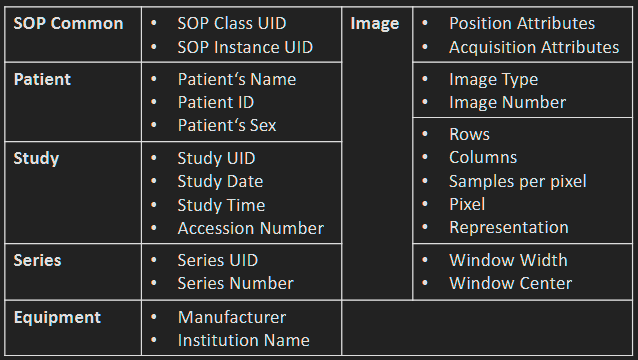

## Begriffskärung und Definitionen

* **Anatomie**: aufbau der Organismen;
* **Physiologie**: Physikalischen (Physical), biochemischen (biochemical) und informationsverarbeitenden Funktionen von Lebewesen; Betrachtung der dynamik biologischer Prozesse und deren kausaler zusammenhänge.
* **Pathologische Anatomie**: deals with pathologicallz altered parts of the body.
* **Pathophysiologie**: investigate the dynamic development of pathological conditions.
(untersucht dynamische Entwicklungen von krankhaften zuständen)
* **Bildgebende Systeme**: ermöglichen eine Abbidung der Anatomie oder funktionaler Prozesse.
* **Monitoring**: bezeichnet die Überwachung und Aufzeichung von körperaktivitäten über längeren zeitraum

### Anwendung von bildgebenden Systemen
|G|En|
|:--|:--|
| Vorsorgeuntersuchung | *Screening* |
| Diagnostik | *Screening* |
| Überwachung | *Monitoring* |
| interventionellerMaßnahmen | *Interventional procedures* |
| Bildgestützte Therapie |  *Image-guided therapy* |
| Therapie- und Verlaufskontrolle |  *Treatment and progress monitoring*|
| Nachuntersuchung | *Follow-up examination* |

### Medizinische Qualitätsmerkmale

| De | En |
|:--|:--|
| Darstellung von Organen und deren Grenzen | *Visualization of organs and their boundaries* |
| Detektion und Differenzierung pathologischer Symptome | *Detection and differentiation of pathological findings* |
| Abgrenzung gutartiger von bösartigen Gewebeveränderungen (→ Tumor) (Segmentation) | *Differentiation of benign and malignant tissue changes (→ tumor) (segmentation)* |
| Tumorstaging / TNM-Klassifikation (T = Tumor, N = Nodes/Lymphknoten, M = Metastasen) | *Tumor staging / TNM classification (T = Tumor, N = Nodes/Lymph Nodes, M = Metastases)* |
| Belastung des Patienten und Arztes (Strahlung, psychologische Belastung, Dauer, Kontrastmittel) | *Burden on the patient and physician (radiation exposure, psychological stress, examination duration, contrast agents)* |

### Bildgebungsverfahren
| De | En | 中文解释 |
|:--|:--|:--|
| Endoskopie | Endoscopy | 内窥镜检查，利用光波（Lichtwellen）直接观察人体内部器官 |
| Echographie | Ultrasound Imaging / Sonography | 超声成像，利用超声波（Ultraschallwellen）产生图像 |
| Röntgen / Angio | X-ray / Angiography | X射线成像和血管造影，利用X射线（Röntgenstrahlung） |
| CT / DVT | Computed Tomography (CT) / Digital Volume Tomography (DVT) | 计算机断层扫描，基于X射线重建三维结构 |
| MRT / MRI | Magnetic Resonance Imaging | 磁共振成像，利用磁场和射频信号 |
| Szintigraphie | Scintigraphy | 闪烁显像，利用放射性示踪剂发出的辐射 |
| PET | Positron Emission Tomography | 正电子发射断层扫描，利用正电子辐射 |
| SPECT | Single Photon Emission Computed Tomography | 单光子发射计算机断层扫描（常与CT结合） |
| EKG | Electrocardiography (ECG) | 心电图，测量心脏电信号 |
| EMG | Electromyography | 肌电图，测量肌肉电信号 |

| 分类 | 类型 | 典型设备 |
|:--|:--|:--|
| Aufsichtbild | 表面观察 | Kamera, Mikroskop, Endoskop |
| Durchsichtprojektion | 透射投影 | Röntgen, C-Bogen |
| Durchsichtreflektion | 反射成像 | Ultraschall |
| Schichtbild | 断层图像 | CT, MRT |
| Volumenbild | 三维体积图像 | CT, MRT, DVT |
| Oberflächenbild | 表面重建 | 3D Kamera, 3D CT |
| Extrakorporal | 设备在体外 | CT, MRT, PET |
| Intrakorporal | 设备进入体内 | Endoskop, Gastroskop |
| Invasiv | 侵入性 | Röntgen, Kontrastmittel |
| Traumatisierend | 有明显不适 | Biopsie, MRT, Koloskopie |
| Harmlos | 基本无害 | Ultraschall, Kamera |

## Bildformen und Datenformate
| 阶段 | 技术 | 特点 |
|:--|:--|:--|
| 早期 | Fluoreszenzschirm | 医生直接透视，辐射大 |
| 胶片时代 | Röntgenfilm | 灰度高，可长期保存 |
| 过渡时期 | CT → Filmprinter | 数字图像打印成胶片 |
| 现代 | Digitale Speicherung + Spezialmonitor | 全数字化 |
| 图像分析 | Fensterung + Farbdarstellung | 提高诊断能力 |
| 未来趋势 | Quantitative Bildanalyse | 从定性走向定量 |

| DICOM 功能 | 说明 |
|:--|:--|
| Bildformat | 统一存储 CT、MRI、PET、超声等医学图像 |
| Patientendaten | 保存患者和检查信息 |
| Kommunikation | 实现设备、PACS、工作站之间的数据交换 |
| Zugriffsrechte | 管理访问权限，保护患者隐私 |
| Server & Fernzugriff | 支持服务器存储和远程访问 |
| Cybersecurity | 提供数据安全和网络安全保障 |

## Ultraschall
**Begriffe**
* Sonographie: Diagnostik der inneren Organe, hauptsächlich Oberbau, Unterbauch und Halsorgane
* Echokardiographie: Diagnostik des Herzens.
* Doppler-Sonografie: Funktionsdiagnostik des Blutflusses in Herz und Gefäßen durch Bestimmung der Blutflussgeschwindigkeit.

**Prinzip**
| 概念 | 说明 |
|:--|:--|
| Reflexionsverfahren | 反射成像，通过接收反射回来的超声波成像 |
| Nicht-invasiv | 非侵入性检查，无已知辐射副作用 |
| Echtzeit | 实时成像，可动态观察器官运动 |
| Gewebegrenzen | 不同组织交界面会产生不同强度的反射 |
| Ultraschallkopf | 探头同时包含发射器(Sender)和接收器(Empfänger) |
| Bildentstehung | 将反射信号转换为图像 |
| Entfernungsberechnung | 根据声速和回波时间差计算组织距离 |

## Endoskopie

## Röntgen

## Tomographie
