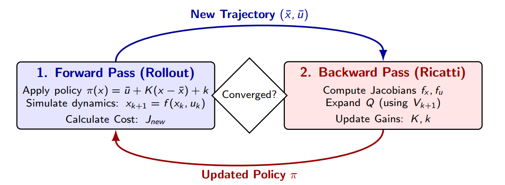

Given by: Asst. Prof. Gokhan Alcan

1. [**Optimal Control Motivation**](#1-motivation)

2. [**Problem Formulation**](#2-discrete-time-optimal-control)

3. [**Dynamic Programming & Bellman’s Principle**](#3-dynamic-programming--bellmans-principle)

4. [**Iterative LQR**](#4-ilqr)

5. Demo: Cart-Pole Swing-Up

6. Constrained Optimal Control

---
## 1. Motivation
Optimization cost(time or frequency-domain). In the time domain, judge a closed-loop step response:
* Lower rise time $\implies$ bigger overshoot.
* Lower overshoot $\implies$ longer rise time.

method:
1. Imposing additional constraints.
2. *Integral criteria*
let $e = r - y$(reference - output), following common scalar measures how good a response is:

**IAE**: Integral of $|e|$ from 0 to $\infty$.
**ITAE**: Integral of $t|e|$ from 0 to $\infty$.
**ISE**: Integral of $e^2$ from 0 to $\infty$.

Balance tracking vs effort with a weighted sum:
$$J = \int_{0}^{\infty} \left( \underbrace{q e^2}_{\text{tracking}} + \underbrace{r u^2}_{\text{effort}} \right) dt \qquad (q, r)\text{: designer-chosen \textbf{weights}}$$

**What Optimization variables to choose**
* **Controllers**: Pick a class(e.g. PID) and optimize its parameters. $J$ is a function of these parameters(evaluated by simulation); closed-loop stability conditions make the problem typically nonconvex. 

Because the control system must also satisfy the strict condition of ‘closed-loop stability’, the graph of the objective function J as a function of the parameters resembles a series of undulating peaks and valleys, riddled with ‘local optima’ (traps). Optimisation algorithms can easily get stuck in a ‘false optimum’ and fail to find the truly optimal set of parameters.

* **Control signals**: Optimize $u(t)$ directly. Awkward in continout time(function-space problem); So we just solve in discrete (sequence) time -- back to finite-dimensional optimization.

Skip the 'controller' altogether and ask directly: at every point in time t, how much u(t) should be given. <strong>Function-space problem</strong>: In a continuous physical world, time is infinitely dense. This means that within any given period of time, there are an infinite number of points in time.

## 2. Discrete-Time Optimal Control
$$
\begin{aligned}
\min_{\{u_k\}_{k=0}^{N-1}} \quad & J = \sum_{k=0}^{N-1} \ell(x_k, u_k) + \ell_N(x_N) \\
\text{s.t.} \quad & x_{k+1} = f(x_k, u_k), \quad k = 0, \dots, N-1 \\
& h_k(x_k, u_k) = 0, \quad k = 0, \dots, N-1 \\
& g_k(x_k, u_k) \le 0, \quad k = 0, \dots, N-1 \\
& h_N(x_N) = 0 \\
& g_N(x_N) \le 0 \\
& x_0 = x_{\text{init}}
\end{aligned}
$$

This approach is widely used in model predictive control (MPC), robotic path planning and economic system optimisation.

* Optimization variable $\{u_k\}_{k=0}^{N-1}$ refers to the control inputs (such as the accelerator, brakes and steering angle of an autonomous vehicle) that we need to apply at each of the N time steps, ranging from 0 to N−1. Our task is to find the optimal sequence of control signals.

* Cost function J: we want the **lowest cost**:

$\sum_{k=0}^{N-1} \ell(x_k, u_k)$ -- Stage Cost: represents the immediate cost incurred at each intermediate time step **k** due to the state deviating from the target (for example, the car veering off course) or the control action being too forceful (for example, slamming the accelerator).

$\ell_N(x_N)$ -- Terminal Cost: indicates how far the system’s final state is from our true endpoint at the conclusion of the Nth step. This is typically used to ensure that the system converges stably.

`s.t.` is an abbreviation for ‘subject to’, meaning ‘provided that the following conditions are met’.
1. System dynamics constraints (Physics/Dynamics): $x_{k+1} = f(x_k, u_k)$.
2. Path Constraints $h_k(x_k, u_k) = 0, \quad g_k(x_k, u_k) \le 0$
This is a strict requirement that must be met at every intermediate point throughout the entire process (from k=0 to N−1). 

$h_k=0$ Equational constraints (e.g. dynamics, terminal goal, grasp constrains)
$g_k \le 0$ Inequality constraints (e.g. bounds, obstacles, frictions, cones ).

## 3. Dynamic Programming & Bellman’s Principle
* **Main idea of Dynamic Programming**: always remember the answers to the sub-problems you have already solved.
* If a problem can be broken down into smaller sub-problems, those can be broken into smaller ones still, and some sub-problems overlap -- then you have a DP problem.

> “An optimal policy has the property that no matter what the previous decisions (i.e., controls) have been, the remaining decisions must constitute an optimal policy with regard to the state resulting from those previous decisions." -- Bellman, 1957

Applying this principle reduces the number of candidates for the optimal solution: once we know the
optimal sub-path from b to e, any a→e trajectory through b must reuse it.

## 4. iLQR
We are given three things:
1. An initial state $x_0$ (start position)
2. A guessed control sequence $\bar{U} = (\bar{u}_0, . . . , \bar{u}_{N-1})$ (initial "plan")
3. Known dynamics $x_{k+1} = f(x_k,u_k)$ (physics model) 

Without optimization, nominal trajectory $\bar{X} = (\bar{x}_0, ... ,\bar{x}_N)$ (usually bad)
$$
\min_{\{u_k\}_{k=0}^{N-1}}  J = \sum_{k=0}^{N-1} \ell(x_k, u_k) + \ell_N(x_N) \\
$$

**Running cost** $\ell(x_k, u_k)$
* Penalizes deviation from goal along the way.
* Penalizes large control effort (energy).
* Typically: $\ell = ||x_k - x_{ref}||^2_Q + ||u_k||^2_R$

**Terminal cost** $\ell(x_N)$ = Boundary Condition
* Penalizes where we end up.
* Often lare weight $\implies$ "reach to the goal!".
* Typically: $\ell_N = ||x_N - x^*||^2_{Q_f}$
* At the last step $k = N$, there are no more decisions.
* So the "cost-to-go" from $x_N$ is simply $\ell_N(X_N)$
* This is $V_N(X_N) = \ell_N(x_N)$ -- the value function seed.
* The backward pass starts here and walks back to $k=0$.

> The Big idea: One big optimization can be solved as many small ones, one step at a time.
### Recall: exact DP
From the Bellman recursion:

$$Q_k(x, u) = \ell(x, u) + V_{k+1}(f(x, u))$$
$$V_k(x) = \min_{u} Q_k(x, u)$$

**Why we can't solve this directly:**
* $V_k$ and $Q_k$ are functions over the *whole* continuous state–action space.
* A grid over $\mathbb{R}^{n_x}$ scales as $\mathcal{O}(N^{n_x})$ — **curse of dimensionality**.
* No closed form for general nonlinear $\ell$ and $f$.

---

### iLQR: model $Q$ only near a guess
Start from a *nominal* rollout (Step 0):

$$(\bar{x}_0, \bar{u}_0), (\bar{x}_1, \bar{u}_1), \dots, \bar{x}_N$$

Define **perturbations** around it:

$$\delta x_k = x_k - \bar{x}_k, \quad \delta u_k = u_k - \bar{u}_k$$

Approximate $Q_k$ as a **quadratic** in $(\delta x_k, \delta u_k)$ centered at $(\bar{x}_k, \bar{u}_k)$.

Valid only *near* the nominal — we will rebuild the model after every trajectory update.

### Second-order Taylor at $(\bar{x}_k, \bar{u}_k)$
Drop the constant $Q_k(\bar{x}_k, \bar{u}_k)$ (it does not affect $\arg\min_{\delta u}$). The remaining gradient + Hessian terms:

$$Q(\delta x, \delta u) \approx \underbrace{\begin{bmatrix} Q_x \\ Q_u \end{bmatrix}^\top \begin{bmatrix} \delta x \\ \delta u \end{bmatrix}}_{\text{linear (gradient)}} + \frac{1}{2} \underbrace{\begin{bmatrix} \delta x \\ \delta u \end{bmatrix}^\top \begin{bmatrix} Q_{xx} & Q_{xu} \\ Q_{ux} & Q_{uu} \end{bmatrix} \begin{bmatrix} \delta x \\ \delta u \end{bmatrix}}_{\text{quadratic (Hessian)}}$$

All blocks $Q_x, Q_u, Q_{xx}, Q_{xu}, Q_{uu}$ are partial derivatives of $Q_k$, evaluated **at the nominal** $(\bar{x}_k, \bar{u}_k)$ — so they are **just numbers/matrices**, not functions.

---

### 1. Coefficients via chain rule
Recall $Q_k(x, u) = \ell(x, u) + V_{k+1}(f(x, u))$.
Differentiating and writing $V' \equiv V_{k+1}$:

$$
\begin{aligned}
Q_x &= \ell_x + f_x^\top V_x' \\
Q_u &= \ell_u + f_u^\top V_x' \\
Q_{xx} &= \ell_{xx} + f_x^\top V_{xx}' f_x + V_x' \cdot f_{xx} \\
Q_{uu} &=\ell_{uu} + f_u^\top V_{xx}' f_u + V_x' \cdot f_{uu} \\
Q_{ux} &= \ell_{ux} + f_u^\top V_{xx}' f_x + V_x' \cdot f_{ux} 
\end{aligned}
$$

where $\ell_x, \ell_{xx}, \dots$ are partials of the stage cost;
$f_x, f_u$ are dynamics Jacobians at $(\bar{x}_k, \bar{u}_k)$;
and $V_x', V_{xx}'$ are inherited from the **next step's** value (backward pass).

$\ell_{xx}$:

The degree of curvature of the cost function at this stage (for example, the penalty increase sharply the further it is from the target)

$f_x^\top V_{xx}' f_x$:

The value curvature is propagated back in the next stage. This means that, due to the existence of the system dynamics f(x), a change in the current state will cause a change in the future state, thereby causing a change in the future total value V_xx.

$\color{red}{V_x' \cdot f_{xx}}$:

The non-linearity inherent in system dynamics. If the robot’s dynamics, f, are non-linear (for example, due to air resistance or joint rotation), this final term will arise.
在实际应用中，如果保留最后一项红色的 $V_x' \cdot f_{xx}$，这个算法叫做 DDP（Differential Dynamic Programming，微分动态规划）；
如果因为 $f_{xx}$（张量计算）太难算而直接把它丢弃（当成 0），这个算法就是 iLQR。iLQR 虽然忽略了动力学的二阶项，但极大地减少了计算量，而且在绝大多数机器人场景下依然收敛得很好！

###  

### 2. Minimize Q for local Policy
**For each $\delta x$, find the best $\delta u$**
Since $Q$ is quadratic in $\delta u$, the minimum is at the stationary point. Take the gradient w.r.t. $\delta u$:

$$\frac{\partial Q}{\partial \delta u} = Q_u + Q_{ux} \delta x + Q_{uu} \delta u$$

Set it to zero (assuming $Q_{uu} \succ 0$):

$$Q_u + Q_{ux} \delta x + Q_{uu} \delta u \overset{!}{=} 0$$

Solve for $\delta u$:

$$\delta u^\star = -Q_{uu}^{-1} (Q_u + Q_{ux} \delta x)$$

Split the constant from the $\delta x$-dependent part:

$$\delta u^\star = \underbrace{-Q_{uu}^{-1} Q_u}_{\mathbf{k}_k \text{ (feedforward)}} + \underbrace{(-Q_{uu}^{-1} Q_{ux})}_{\mathbf{K}_k \text{ (feedback)}} \delta x$$

---

### Implementation practice
> **Regularize $Q_{uu}$ before inverting.**
> Far from the optimum, $Q_{uu}$ can be *ill-conditioned* or even *indefinite*.
> A direct inverse then produces huge or completely wrong steps.
> Levenberg–Marquardt fix:
> 
> $$\tilde{Q}_{uu} = Q_{uu} + \lambda I, \quad \lambda \ge 0$$

* $\lambda \to 0$: full Newton step (fast).
* $\lambda \to \infty$: gradient descent (safe).
* **Trust-region schedule:**
  $\lambda \uparrow$ on rejected step, $\lambda \downarrow$ on accepted step.

### 3. Value Update (Backward Prop)
Plug $\delta u^\star$ back into the quadratic expansion to update the Value function approximation ($V_x, V_{xx}$) for step $k$:

$$V_x = Q_x + K^\top Q_u + K^\top Q_{uu} k + Q_{xu} k$$
$$V_{xx} = Q_{xx} + Q_{xu} K + K^\top Q_{ux} + K^\top Q_{uu} K$$

* These $V_x, V_{xx}$ are passed to step $k - 1$

**Algorighm Overview**

1. **Forward Pass / Rollout**
  * Apply control policy: use $\pi(x) = \bar{u} + K(x - \bar{x}) + k$ to compute control input.
    * $\bar{u}$ is the reference control value from the previous iteration.
    * $K(x - \bar{x})$ is the state feedback, to fix the difference between actual state $x$ and desired state $\bar{x}$.
    * $k$ is the Feedforward term, used to adjust the control reference as a whole.
  * Simulate dynamics: according to $x_{k+1} = f(x_k, u_k)$, calculate the Roolout on time.
  * Calculate cost: $J_{new}$, is the cost of new trajectory.
2. **Backward Pass (Ricatti)**
  > In this step, the algorithm works backwards from the end of the trajectory to the start, using the Bellman equation and the Riccati equation to optimise the policy:
  * Compute Jacobians: at every timestep of ths trajectory, calculate $f_x$ and $f_u$. (Locally linearization)
  * Expand Q: by using the next timestep motion cost $V_{k+1}$, perform a quadratic Taylor expansion of the current Q-function
  * Update Gains: compute the feed fowrard $K$ and feedback $k$ gains.
3. **Convergence test**
  * Difference between new/old trajectory is small enough? ($J_{old} - J_{new}$)
  * Or the feedback gain is close to 0.
  * None convergence? then update the policy then proceed forward pass.

<strong>Properities & Limitations</strong>

* Local Optima: As a Newton-method variant, it converges to a local minimum. Good initialization is a key.

* Model Requirement: The backward  step strictly requires partial derivatives of the model (f_x, f_u)

* Speed: Very fast for smooth dynamics.

