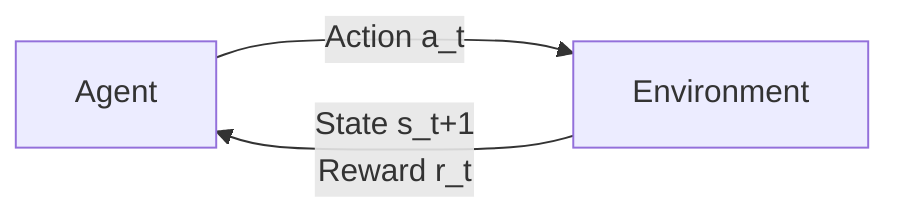
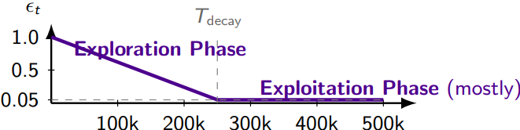
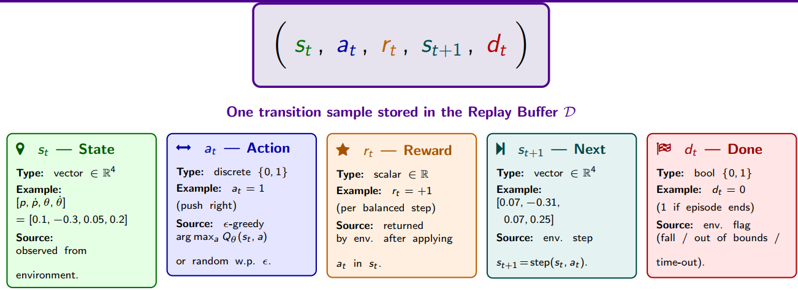

Given by: Asst. Prof. Gokhan Alcan

## Recap
1. Define cost-to-go $V_k(x)$ (min cost from time k to N)
2. Split the problem ( Current step + Future)
3. The Result (Recursive Optimality)

**Pro:**
1. Decoupling: dont solve the full trajectory at once, solve one step at a time, working backwards from N to 0.
2. The RL connection: 
    * in optimal control, we calculate V using the model f. 
    * in RL, we learn Q directly so we can pick u without needing f.

## From OC to RL
| 最优控制 (Optimal Control) | 强化学习 (Reinforcement Learning) |
| :--- | :--- |
| 状态 (State) $x_k$ | 状态 (State) $s_t$ |
| 控制输入 (Control Input) $u_k$ | 动作 (Action) $a_t$ |
| 阶段代价 (Stage Cost) $\ell(x, u)$ | 回报 (Reward) $r(s, a) \approx -\ell$ |
| 终端代价 (Terminal Cost) $\ell_N(x)$ | 终端回报 (Terminal Reward) |
| 动力学 (Dynamics) $f(x, u)$ | 环境 (Env.) $P(s' \mid s, a)$ |
| 时界 (Horizon) $N$ | 折扣因子 (Discount) $\gamma$ |
| 控制器 (Controller) | 策略 (Policy) $\pi(a \mid s)$ |

### RL Objective
Maximize the expected cumulative discounted reward: 

$$
J(\pi) = \mathbb{E}_{\tau \sim \pi} \left[ \sum_{t=0}^{\infty} \gamma^t r(s_t, a_t) \right]
$$

* **$\gamma \in [0, 1)$**：折扣因子 (Discount factor)，在无限时界问题中替代了有限时界 $N$。
* **$\mathbb{E}$**：期望值 (Expectation)，用于处理环境或策略中的随机性 (stochasticity)。

### The Vocabulary of RL

| 核心概念 (Concept) | 数学符号 (Notation) | 倒立摆示例 (Cart-Pole Example) |
| :--- | :--- | :--- |
| **策略 (Policy)** (The Controller) | <ul><li>$\pi_{\theta}(a \mid s)$ (随机性策略 Stochastic)</li><li>$\mu_{\theta}(s)$ (确定性策略 Deterministic)</li></ul> | “如果杆子向右倾斜 ($s$)，以 0.9 的概率向右推 ($a$)。” |
| **价值函数 (Value Functions)** (The Critic) | <ul><li>$V^{\pi}(s) = \mathbb{E}\left[\sum \gamma^t r_t\right]$</li><li>$Q^{\pi}(s, a)$</li></ul> | <ul><li>$V^{\pi}$：“当前这个状态有多好？”</li><li>$Q^{\pi}$：“**现在立刻**向左推有多好？”</li></ul> |
| **优势函数 (Advantage)** (Relative Value) | $A^{\pi}(s, a) = Q^{\pi}(s, a) - V^{\pi}(s)$ | “相比于当前策略的平均表现，做这个动作能好多少？” |
| **轨迹 (Trajectory)** (Rollout) | $\tau = (s_0, a_0, r_0, s_1, \dots)$ | 从开始（杆子竖直）到失败（杆子倒下）的单次完整模拟运行。 |

### Critical Assumptions
1. Environment Assumptions (The Physics)
    * **Markov Property**: the state $s_t$ is sufficient. History doesnt matter
    (ONLY the current state matter, its enough to transit to next state)
    * **Stationarity**:  The environment dynamics $P(s'|s,a)$ do not change over time. (mass or something stays constant)
    * **Ergodicity & Coverage**: The agent can reach all relevant states with non-zero probability.
    (Implication: If we stop exploring (greedy), we violate this and stop learning)
2. Structural Assumptions 
    * **Reward Boundedness**: Rewards are finite. We use a discount factor $\gamma < 1$ to ensure the infinite sum converges:
    $$
    \sum_{t=0}^{\infty} \gamma^t r_t < \infty
    $$
    * **Function Approximation Class**：
        * Linear: Convex optimization, convergence guarantees, able to find global optima.
        * Neural Networks: Non-convex, no strong guarantees, but scales to high dimensions (images, complex dynamics)
    * **Deep Q-Networks**
        * $Q_{\theta}(s,a)$: Parameterized by weights $\theta$.
        * $Q_{\phi}(s,a)$: Parameterized by weight $\phi$ (a frozen copy of $\theta$).
 ### Bell man optimality for RL
 1. recursive optimality(OC)
$$
V_k(x) = \min_{u} \Big[ \ell(x, u) + V_{k+1}(f(x, u)) \Big]
$$
2. Action value $Q_k$
current state cost + remaining states' within the bracket as the action value, consequently, the state value function can be simplified to minimising $Q_k$:
$$
Q_k(x, u) := \ell(x, u) + V_{k+1}(f(x, u))
$$

$$
V_k(x) = \min_{u} Q_k(x, u)
$$

3. subsitute $V_{k+1} = \min_{u'} Q_{k+1}$ into Q. Recursive form, purely in $Q$
$$
Q_k(x, u) = \ell(x, u) + \min_{u'} Q_{k+1}\big(f(x, u), u'\big)
$$
4. Bellman optimality equation in RL
$$
Q^*(s, a) = r(s, a) + \gamma \max_{a'} Q^*(s', a')
$$

**Exploration policy**:
$\epsilon$ - greedy schedule.
**Experience Replay**:
Buffer D of past transitions $\implies$ decorrelate samples.
**TD target & loss:**:
在训练时，我们通过当前步的奖励 $r$ 和下一步的极大动作价值来构建 **TD 目标值 (TD Target)** $y$：

$$
y = r + \gamma \max_{a'} Q_{\phi}(s', a')
$$

随后，利用均方误差 (MSE) 构建 **损失函数 (Loss Function)**，通过梯度下降来更新当前网络参数 $\theta$：

$$
\mathcal{L}(\theta) = \big( Q_{\theta}(s, a) - y \big)^2
$$

---

**Target update rule**

为了解决训练中的非平稳目标问题，DQN 引入了**目标网络 (Target Network)**：
* **$Q_{\theta}$**：当前网络 (Online Network)，其参数 $\theta$ 在每一步都在通过梯度下降进行实时更新。
* **$Q_{\phi}$**：目标网络 (Target Network)，其参数 $\phi$ 保持冻结，仅进行**周期性同步 (Periodic copy)**：

$$
\phi \leftarrow \theta \quad (\text{every } C \text{ steps})
$$
**Explorations schedule**
The exploration rate $\epsilon_t$ linearly decays from an initial value to a minimum floor over a fixed duration $T_{decay}$, then remains constant.
$$
\epsilon_t = \max \left( \epsilon_{\text{end}}, \, \epsilon_{\text{start}} - \frac{\epsilon_{\text{start}} - \epsilon_{\text{end}}}{T_{\text{decay}}} \cdot t \right)
$$

---
1. 动作选择 (Action Selection: $\epsilon$-Greedy)

在当前时间步，智能体以 $\epsilon_t$ 的概率进行**随机探索**：

$$
a_t \sim \text{Uniform}(\mathcal{A})
$$

否则（以 $1 - \epsilon_t$ 的概率），根据当前策略网络选择能够带来最大估计价值的**贪婪动作**：

$$
a_t = \arg\max_{a \in \mathcal{A}} Q_{\theta}(s_t, a)
$$

---

2. 环境模拟步 (Simulation Step)

在环境中执行选择的动作 $a_t$，并从环境反馈中获取以下信息：
* **下一状态 $s_{t+1}$** (Next state)
* **奖励 $r_t$** (Reward)
* **终止标志 $d_t$** (Termination flag)：若达到终止状态则 $d_t = 1$，否则 $d_t = 0$。

---

3. 数据存储与状态更新 (Storage & Update)

**存储经验**：将这一步产生的五元组（转移数据 Transition）存入**经验回放缓冲区 (Replay Buffer)** $\mathcal{D}$ 中：

$$
\mathcal{D} \leftarrow \mathcal{D} \cup \big\{ (s_t, a_t, r_t, s_{t+1}, d_t) \big\}
$$

**更新当前状态**：向前推进时间步，将当前状态设为下一状态，进入新的循环：

$$
s_t \leftarrow s_{t+1}
$$

## 5-Tuple:
It carries everything needed to evaluate the TD target later:

**TD Target with Termination**
$$
y_t = r_t + (1 - d_t) \gamma \max_{a'} Q_{\phi}(s_{t+1}, a')
$$
**Loss Function**
$$
\mathcal{L}(\theta) = \big( Q_{\theta}(s_t, a_t) - y_t \big)^2
$$

---

###  Core Training Loop

For every train step：

#### 1. Sampling
从经验回放缓冲区 $\mathcal{D}$ 中随机抽取一个大小为 $B = 128$ 的小批次（Minibatch）数据：

$$
\{(s_j, a_j, r_j, s'_j, d_j)\}_{j=1}^B \sim \mathcal{D}
$$

#### 2. Target Calculation
Compute Temporal Difference TD using Targe Network**目标网络 $Q_\phi$** 计算离策（Off-Policy）的时序差分目标值 $y_j$。**此步骤不需要计算梯度**：

$$
y_j = r_j + \gamma \cdot (1 - d_j) \cdot \max_{a' \in \mathcal{A}} Q_\phi(s'_j, a')
$$

#### 3. Loss Calculation
计算目标网络输出的 $y_j$ 与当前网络 $Q_\theta$ 预测值之间的均方误差（MSE）：

$$
\mathcal{L}(\theta) = \frac{1}{B} \sum_{j=1}^B \big( y_j - Q_\theta(s_j, a_j) \big)^2
$$

#### 4. Gradient Descent
对当前网络参数 $\theta$ 执行梯度下降步以完成参数更新：

$$
\theta \leftarrow \theta - \alpha \cdot \nabla_\theta \mathcal{L}(\theta)
$$

---

#### 4. Target Network Update

为了保证训练的稳定性，每隔固定的步数（满足 `target_frequency` 步数要求时），更新目标网络权重 $\phi$：

* **Hard Update, $\tau = 1.0$**：直接将当前网络的权重完全复制给目标网络：
  $$
  \phi \leftarrow \theta
  $$
* **Soft Update, $\tau < 1.0$**：让目标网络向当前网络平滑逼近：
  $$
  \phi \leftarrow \tau\theta + (1 - \tau)\phi
  $$

---

#### Hyper Parameters

| Hyper Parameteres | Math | Classical value | Usuage |
| :--- | :--- | :--- | :--- |
| **经验回放区容量** | Capacity $N$ | `10,000` | 存储历史转移数据 $(s, a, r, s', d)$ 的上限 |
| **优化器与学习率** | Adam ($\alpha$) | $2.5 \times 10^{-4}$ | 控制当前网络 $\theta$ 梯度下降的步长 |
| **折扣因子** | $\gamma$ | `0.99` | 衡量未来长远奖励的衰减权重 |

**Weight $\gamma$**:
* $\gamma \rightarrow 0$: Greedy, only cares about the immediate reward $r_t$.
* $\gamma \rightarrow \infty$: Strategic, values long term cumulative return.

**Moving Target**
In standard supervised learning, targets(y) are fixed. In RL the target useing the changing network:
$\text{Target} \quad y_t = r +\gamma\max_{a'} Q_{\theta}(s',a')$
* When we update weights $\theta$ to approach y_t, the target y_t moves as well.
* Result: Correlation loops, maximization bias, and divergence.

**Solution: Twin Network**
$Q_{\theta}$, a clone of the main network that is frozen in time.