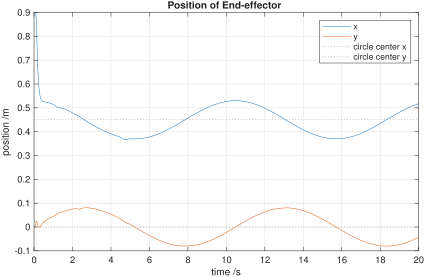
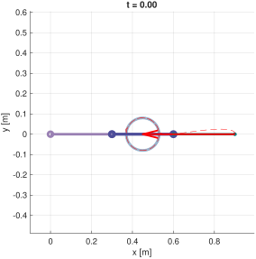
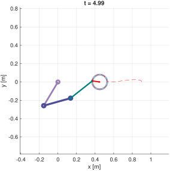
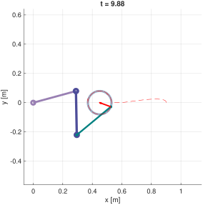
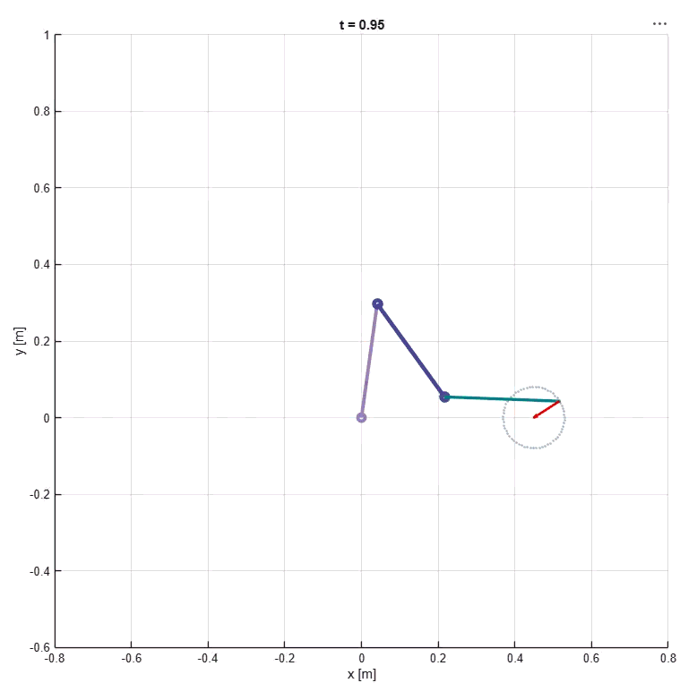
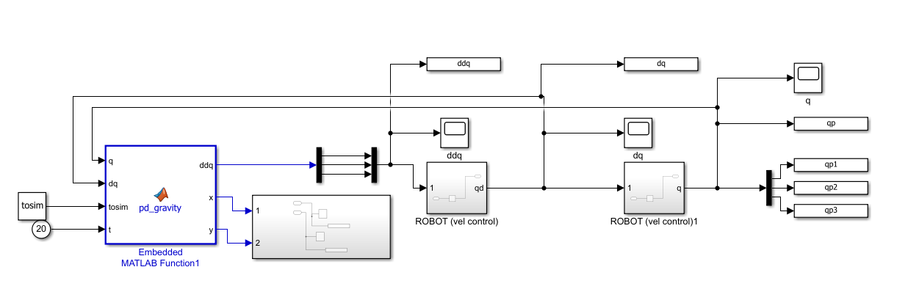

## 1. 3 DOF manipulator dynamics

>abbreviations
* $c1 = \cos(\theta_1)$ | $c2 = \cos(\theta_2)$ | $c3 = \cos(\theta_3)$
* $s_{12} = \sin(\theta_1 + \theta_2)$
* $c_{123} = \cos(\theta_1 + \theta_2 + \theta_3)$
* $c_{23} = \cos(\theta_2 + \theta_3)$

### Translational kinetic energy

link 1:
$$
\begin{align*}
&x_{c1} = \frac{l_1}{2}c_1  ,\space  y_{c1} = \frac{l_1}{2}s_1 \\
&v_{c1}^2 = (\frac{l_1}{2})^2\dot{\theta}_1^2
\end{align*}
$$
kinetic energy
$$
\frac{1}{2}m_1v_{c1}^2 = \frac{1}{8} m_1 l_1\dot{\theta}_1^2
$$
link 2:
$$
\begin{align*}
&x_{c2} = l_1c_1 + \frac{l_2}{2}c_{12} ,\space y_{c2} = l_1s_1 + \frac{l_2}{2}s_{12} \\
&v_{c2}^2 = l_1^2\dot{\theta}_1^2 + (\frac{l_2}{2})^2(\dot{\theta}_1+\dot{\theta}_2)^2 + l_1l_2\dot{\theta}_1(\dot{\theta}_1+\dot{\theta}_2)c2
\end{align*}
$$
kinetic energy
$$
\frac{1}{2}m_2v_{c2}^2 = \frac{1}{2}m_2l_1^2\dot{\theta}_1^2 + \frac{1}{8}m_2l_2^2(\dot{\theta}_1+\dot{\theta}_2)^2 + \frac{1}{2}m_2l_1l_2\dot{\theta}_1(\dot{\theta}_1+\dot{\theta}_2)c2
$$

link 3:
$$
\begin{align*}
x_{c3} &= l_1c_1 + l_2c_{12} + \frac{l_3}{2}c_{123} \\
y_{c3} &= l_1s_1 + l_2s_{12} + \frac{l_3}{2}s_{123} \\
v_{c3}^2 &= \dot{x}_{c3}^2 + \dot{y}_{c3}^2
\end{align*}
$$

$$
v_{c3}^2 = l_1^2 \dot{q}_1^2 + l_2^2 \dot{q}_{12}^2 + (\frac{l_3}{2})^2 \dot{q}_{123}^2 + 2 l_1 l_2 \dot{q}_1 \dot{q}_{12} c_2 +  l_2 l_3 \dot{q}_{12} \dot{q}_{123} c_3 + l_1 l_3 \dot{q}_1 \dot{q}_{123} c_{23}
$$
kinetic energy
$$
\frac{1}{2}m_3v_{c3}^2 = \frac{1}{2}m_3l_1^2 \dot{q}_1^2 + \frac{1}{2}m_3l_2^2 \dot{q}_{12}^2 + \frac{1}{8}m_3l_3^2 \dot{q}_{123}^2 \\
+ m_3 l_1 l_2 \dot{q}_1 \dot{q}_{12} c_2 +  \frac{1}{2}m_3 l_2 l_3 \dot{q}_{12} \dot{q}_{123} c_3 + \frac{1}{2}m_3 l_1 l_3 \dot{q}_1 \dot{q}_{123} c_{23}
$$

### Rotational kinetic energy
Angular velocity:
$\omega_1 = \dot{\theta}_1, \quad \omega_2 = \dot{\theta}_1 + \dot{\theta}_2, \quad \omega_3 = \dot{\theta}_1 + \dot{\theta}_2 + \dot{\theta}_3$

$$
I = \frac{1}{12}ml^2
$$
link 1:
$$
\frac{1}{2} I_1 \dot{\theta}_1^2 = \frac{1}{24} m_1 l_1^2 \dot{\theta}_1^2
$$
link 2:
$$
\frac{1}{2} I_2 (\dot{\theta}_1^2 + \dot{\theta}_2^2 + 2\dot{\theta}_1\dot{\theta}_2)
$$
link 3:
$$
\frac{1}{2} I_3 (\dot{\theta}_1^2 + \dot{\theta}_2^2 + \dot{\theta}_3^2 + 2\dot{\theta}_1\dot{\theta}_2 + 2\dot{\theta}_2\dot{\theta}_3 + 2\dot{\theta}_1\dot{\theta}_3)
$$

### kinetic energy
$$
K_1 = \left( \frac{1}{8} m_1 l_1^2 + \frac{1}{24} m_1 l_1^2 \right) \dot{\theta}_1^2 = \mathbf{\frac{1}{6} m_1 l_1^2 \dot{\theta}_1^2}
$$

$$
K_2 = \frac{1}{2} m_2 l_1^2 \dot{\theta}_1^2 + \mathbf{\frac{1}{6} m_2 l_2^2 (\dot{\theta}_1 + \dot{\theta}_2)^2} + \frac{1}{2} m_2 l_1 l_2 \dot{\theta}_1 (\dot{\theta}_1 + \dot{\theta}_2) \cos\theta_2
$$

$$
\begin{aligned}
K_3 = & \frac{1}{2} m_3 l_1^2 \dot{\theta}_1^2 + \frac{1}{2} m_3 l_2^2 (\dot{\theta}_1 + \dot{\theta}_2)^2 + \mathbf{\frac{1}{6} m_3 l_3^2 (\dot{\theta}_1 + \dot{\theta}_2 + \dot{\theta}_3)^2} \\
& + m_3 l_1 l_2 \dot{\theta}_1 (\dot{\theta}_1 + \dot{\theta}_2) \cos\theta_2 \\
& + \frac{1}{2} m_3 l_2 l_3 (\dot{\theta}_1 + \dot{\theta}_2) (\dot{\theta}_1 + \dot{\theta}_2 + \dot{\theta}_3) \cos\theta_3 \\
& + \frac{1}{2} m_3 l_1 l_3 \dot{\theta}_1 (\dot{\theta}_1 + \dot{\theta}_2 + \dot{\theta}_3) \cos(\theta_2 + \theta_3)
\end{aligned}
$$

total kinetic energy K
$$
K = D_1 \dot{q}_1^2 + D_2 \dot{q}_{12}^2 + D_3 \dot{q}_{123}^2 + D_{12} c_2 \dot{q}_1 \dot{q}_{12} + D_{23} c_3 \dot{q}_{12} \dot{q}_{123} + D_{13} c_{23} \dot{q}_1 \dot{q}_{123}
$$
where,
$$
\begin{align*}
D_1 &= (\frac{1}{6}m_1 + \frac{1}{2}m_2 + \frac{1}{2}m_3)l_1^2 \\
D_2 &= (\frac{1}{6}m_2 + \frac{1}{2}m_3)l_2^2 \\
D_3 &= \frac{1}{6}m_3 l_3^2 \\
D_{12} &= (\frac{1}{2}m_2 + m_3)l_1 l_2 \\
D_{23} &= \frac{1}{2}m_3 l_2 l_3 \\
D_{13} &= \frac{1}{2}m_3 l_1 l_3
\end{align*}
$$

### Potential Energy
$$
P =  \underbrace{\frac{1}{2} m_1 g l_1 s_1}_{P_1} + \underbrace{m_2 g (l_1 s_1 +  \frac{1}{2} l_2 s_{12})}_{P_2} + \underbrace{m_3 g (l_1 s_1 + l_2 s_{12} + \frac{1}{2} l_3 s_{123})}_{P_3}
$$

### Euler-Lagrange Equation
$$L = K - P$$
By using the partial differential equations:
$$
\tau_k = \frac{d}{dt}\left(\frac{\partial L}{\partial \dot{\theta}_k}\right) - \frac{\partial L}{\partial \theta_k} \quad (k = 1, 2, 3)
$$

$\tau_3$:
$$
\frac{\partial K}{\partial \dot{\theta}_3} = \frac{\partial K}{\partial \dot{q}_{123}} = 2 D_3 \dot{q}_{123} + D_{23} c_3 \dot{q}_{12} + D_{13} c_{23} \dot{q}_1
$$

$$
\frac{d}{dt}\left(\frac{\partial K}{\partial \dot{\theta}_3}\right) = \underbrace{2 D_3 \ddot{q}_{123} + D_{23} c_3 \ddot{q}_{12} + D_{13} c_{23} \ddot{q}_1}_{\text{angular velocity}} \underbrace{- D_{23} s_3 \dot{\theta}_3 \dot{q}_{12} - D_{13} s_{23} (\dot{\theta}_2 + \dot{\theta}_3) \dot{q}_1}_{\text{v squared}}
$$

$$
-\frac{\partial K}{\partial \theta_3} = -(- D_{23} s_3 \dot{q}_{12} \dot{q}_{123} - D_{13} s_{23} \dot{q}_1 \dot{q}_{123}) = + D_{23} s_3 \dot{q}_{12} \dot{q}_{123} + D_{13} s_{23} \dot{q}_1 \dot{q}_{123}
$$

$$
\tau_3 = 2 D_3 \ddot{q}_{123} + D_{23} c_3 \ddot{q}_{12} + D_{13} c_{23} \ddot{q}_1 + D_{23} s_3 \dot{q}_{12}^2 + D_{13} s_{23} \dot{q}_1^2 + G_3
$$
where,
$$
G_3 = \frac{1}{2}m_3 g l_3 c_{123}
$$

$\tau_2$:
$$
\frac{\partial K}{\partial \dot{\theta}_2} = \frac{\partial K}{\partial \dot{q}_{12}} + \frac{\partial K}{\partial \dot{q}_{123}}
$$
$$
\frac{\partial K}{\partial \dot{\theta}_2} = (2 D_2 + D_{23} c_3) \dot{q}_{12} + (2 D_3 + D_{23} c_3) \dot{q}_{123} + (D_{12} c_2 + D_{13} c_{23}) \dot{q}_1
$$
$$
\frac{d}{dt}\left(\frac{\partial K}{\partial \dot{\theta}_2}\right) = 
(2 D_2 + D_{23} c_3) \ddot{q}_{12} + (2 D_3 + D_{23} c_3) \ddot{q}_{123} + (D_{12} c_2 + D_{13} c_{23}) \ddot{q}_1 \\
- D_{23} s_3 \dot{\theta}_3 \dot{q}_{12} - D_{23} s_3 \dot{\theta}_3 \dot{q}_{123} - D_{12} s_2 \dot{\theta}_2 \dot{q}_1 - D_{13} s_{23} (\dot{\theta}_2 + \dot{\theta}_3) \dot{q}_1
$$

$$
-\frac{\partial K}{\partial \theta_2} = -(- D_{12} s_2 \dot{q}_1 \dot{q}_{12} - D_{13} s_{23} \dot{q}_1 \dot{q}_{123}) = + D_{12} s_2 \dot{q}_1 \dot{q}_{12} + D_{13} s_{23} \dot{q}_1 \dot{q}_{123}
$$

$$
\tau_2 = (2 D_2 + D_{23} c_3) \ddot{q}_{12} + (2 D_3 + D_{23} c_3) \ddot{q}_{123} + (D_{12} c_2 + D_{13} c_{23}) \ddot{q}_1
\\ + D_{12} s_2 \dot{q}_1^2 + D_{13} s_{23} \dot{q}_1^2 - D_{23} s_3 (2 \dot{q}_{12} \dot{\theta}_3 + \dot{\theta}_3^2) + G_2
$$
where, 
$$
G_2 = (m_2 \frac{l_2}{2} + m_3 l_2)g c_{12} + \frac{1}{2}m_3 g l_3 c_{123}
$$

$\tau_1$:
$$
\frac{\partial K}{\partial \dot{\theta}_1} = \frac{\partial K}{\partial \dot{q}_1} + \frac{\partial K}{\partial \dot{q}_{12}} + \frac{\partial K}{\partial \dot{q}_{123}}
$$

$$
\begin{aligned}
\tau_1 = & \left[ (2D_1 + 2D_2 + 2D_3) + 2D_{12}c_2 + 2D_{23}c_3 + 2D_{13}c_{23} \right] \ddot{\theta}_1 \\
& + \left[ (2D_2 + 2D_3) + D_{12}c_2 + 2D_{23}c_3 + D_{13}c_{23} \right] \ddot{\theta}_2 \\
& + \left[ 2D_3 + D_{23}c_3 + D_{13}c_{23} \right] \ddot{\theta}_3 \\
& - D_{12} s_2 (2\dot{q}_1 \dot{\theta}_2 + \dot{\theta}_2^2) - D_{23} s_3 (2\dot{q}_{12} \dot{\theta}_3 + \dot{\theta}_3^2) - D_{13} s_{23} \left[ 2\dot{q}_1 (\dot{\theta}_2+\dot{\theta}_3) + (\dot{\theta}_2+\dot{\theta}_3)^2 \right] \\
& + G_1
\end{aligned}
$$

### Mess/Inertia Matrix
The inertia matrix is symmetric:
$$
M(\theta) = 
\begin{bmatrix}
M_{11} & M_{12} & M_{13} \\
M_{21} & M_{22} & M_{23} \\
M_{31} & M_{32} & M_{33}
\end{bmatrix}
$$
$$
M_{11} = 2D_1 + 2D_2 + 2D_3 + 2D_{12} \cos\theta_2 + 2D_{23} \cos\theta_3 + 2D_{13} \cos(\theta_2+\theta_3)
$$

$$
M_{12} = 2D_2 + 2D_3 + D_{12} \cos\theta_2 + 2D_{23} \cos\theta_3 + D_{13} \cos(\theta_2+\theta_3)
$$
$$
M_{13} = 2D_3 + D_{23} \cos\theta_3 + D_{13} \cos(\theta_2+\theta_3)
$$
$$
M_{22} = 2D_2 + 2D_3 + 2D_{23} \cos\theta_3
$$
$$
M_{23} = 2D_3 + D_{23} \cos\theta_3
$$
$$
M_{33} = 2D_3
$$
### Centrifugal force and Coriolis force vectors
$$
V(\theta, \dot{\theta}) = 
\begin{bmatrix}
V_1 \\
V_2 \\
V_3
\end{bmatrix}
$$
$$
V_1 = - D_{12} \sin\theta_2 (2\dot{q}_1 \dot{\theta}_2 + \dot{\theta}_2^2) - D_{23} \sin\theta_3 (2\dot{q}_{12} \dot{\theta}_3 + \dot{\theta}_3^2) \\
- D_{13} \sin(\theta_2+\theta_3) \left[ 2\dot{q}_1 (\dot{\theta}_2+\dot{\theta}_3) + (\dot{\theta}_2+\dot{\theta}_3)^2 \right]
$$
$$
V_2 = D_{12} \sin\theta_2 \dot{q}_1^2 + D_{13} \sin(\theta_2+\theta_3) \dot{q}_1^2 - D_{23} \sin\theta_3 (2 \dot{q}_{12} \dot{\theta}_3 + \dot{\theta}_3^2)
$$
$$
V_3 = D_{23} \sin\theta_3 \dot{q}_{12}^2 + D_{13} \sin(\theta_2+\theta_3) \dot{q}_1^2
$$
### Gravity vector
$$
G(\theta) = 
\begin{bmatrix}
G_1 \\
G_2 \\
G_3
\end{bmatrix}
$$
$$
G_1 = (\frac{1}{2}m_1 + m_2 + m_3)g l_1 c_{1} + (\frac{1}{2}m_2 + m_3)g l_2 c_{12} + \frac{1}{2}m_3 g l_3 c_{123}
$$
$$
G_2 = (\frac{1}{2}m_2 + m_3)g l_2 c_{12} + \frac{1}{2}m_3 g l_3 c_{123}
$$
$$
G_3 = \frac{1}{2}m_3 g l_3 c_{123}
$$
## 2. Task-Space PD Control with Gravity Compensation
$m_1=m_2=m_3=1 kg$ and $l_1=l_2=l_3=0.3 m$
so that:

### Current End-Effector Position
$$

x = l_1c_{1}
+ l_2c_{12}
+ l_3c_{123}

$$
$$

y = l_1s_{1}
+ l_2s_{12}
+ l_3s_{123}

$$
---

### Manipulator Jacobian

$$
J =
\begin{bmatrix}
-l_1s_{1}
- l_2s_{12}
- l_3s_{123}
&
-l_2s_{12}
- l_3s_{123}
&
-l_3s_{123}
\\
l_1c_{1}
+ l_2c_{12}
+ l_3c_{123}
&
l_2c_{12}
+ l_3c_{123}
&
l_3c_{123}
\end{bmatrix}
$$

---

### Task-Space Velocity

$$
\dot{\mathbf{x}} = J\dot{\mathbf{q}}
$$

---

### Task-Space PD Control

Position error:

$$
\mathbf{e}
=
\begin{bmatrix}
x_d \\
y_d
\end{bmatrix}
-
\begin{bmatrix}
x \\
y
\end{bmatrix}
$$

Velocity error:

$$
\dot{\mathbf{e}}
=
\begin{bmatrix}
\dot{x}_d \\
\dot{y}_d
\end{bmatrix}
-
\dot{\mathbf{x}}
$$

Control force:

$$
\mathbf{F}
=
K_p \mathbf{e}
+
K_d \dot{\mathbf{e}}
$$

$$
M(q)\ddot{q} + C(q,\dot{q})\dot{q} + F\dot{q} + g(q) = \tau
$$
$$
\tau = J^{T}\mathbf{F} + F\dot{q} + g(q)
$$

$$
\ddot{\mathbf{q}}
=
M^{-1}
\left(
J^{T}\mathbf{F} - \mathbf{V}
\right)
$$

where:

- $ M $ : manipulator inertia matrix  
- $ J $ : manipulator Jacobian  
- $ \mathbf{F} $ : task-space control force  
- $ \mathbf{V} $ : gravity / nonlinear dynamics term  
- $ \ddot{\mathbf{q}} $ : joint acceleration vector


### Code implementation
```matlab
function [ddq,x,y] = pd_gravity(q, dq, tosim, t)
% parameters
m1 = tosim(1);
m2 = tosim(2);
m3 = tosim(3);
l1 = tosim(4);
l2 = tosim(5);
l3 = tosim(6);
xc = tosim(7);
yc = tosim(8);
r  = tosim(9);
w  = tosim(10);
kp  = tosim(11);
% task-space gains, 2x2
Kp = kp*eye(2);
Kd = 2*sqrt(kp)*eye(2);

th1 = q(1);
th2 = q(2);
th3 = q(3);

dth1 = dq(1);
dth2 = dq(2);
dth3 = dq(3);

dq1  = dth1;
dq12 = dth1 + dth2;

% desired end-effector trajectory
xd  = xc + r*cos(w*t);
yd  = yc + r*sin(w*t);

dxd = -r*w*sin(w*t);
dyd =  r*w*cos(w*t);

% current end-effector position
x = l1*cos(th1) + l2*cos(th1+th2) + l3*cos(th1+th2+th3);
y = l1*sin(th1) + l2*sin(th1+th2) + l3*sin(th1+th2+th3);

% manipulator Jacobian
J = [-l1*sin(th1)-l2*sin(th1+th2)-l3*sin(th1+th2+th3), ...
     -l2*sin(th1+th2)-l3*sin(th1+th2+th3), ...
     -l3*sin(th1+th2+th3);

      l1*cos(th1)+l2*cos(th1+th2)+l3*cos(th1+th2+th3), ...
      l2*cos(th1+th2)+l3*cos(th1+th2+th3), ...
      l3*cos(th1+th2+th3)];

% current task-space velocity
dxy = J*dq;

% task-space PD
e  = [xd; yd] - [x; y];
de = [dxd; dyd] - dxy;

F = Kp*e + Kd*de;

% Dynamics parameters
D1  = m1*l1^2/6 + (m2 + m3)*l1^2/2;
D2  = m2*l2^2/6 + m3*l2^2/2;
D3  = m3*l3^2/6;

D12 = (m2/2 + m3)*l1*l2;
D23 = m3*l2*l3/2;
D13 = m3*l1*l3/2;

c2  = cos(th2);
c3  = cos(th3);
c23 = cos(th2 + th3);

s2  = sin(th2);
s3  = sin(th3);
s23 = sin(th2 + th3);

M11 = 2*D1 + 2*D2 + 2*D3 ...
      + 2*D12*c2 + 2*D23*c3 + 2*D13*c23;

M12 = 2*D2 + 2*D3 ...
      + D12*c2 + 2*D23*c3 + D13*c23;

M13 = 2*D3 + D23*c3 + D13*c23;

M22 = 2*D2 + 2*D3 + 2*D23*c3;
M23 = 2*D3 + D23*c3;
M33 = 2*D3;

M = [M11 M12 M13;
     M12 M22 M23;
     M13 M23 M33];

V1 = -D12*s2*(2*dq1*dth2 + dth2^2) ...
     -D23*s3*(2*dq12*dth3 + dth3^2) ...
     -D13*s23*(2*dq1*(dth2 + dth3) + (dth2 + dth3)^2);

V2 = D12*s2*dq1^2 ...
     + D13*s23*dq1^2 ...
     - D23*s3*(2*dq12*dth3 + dth3^2);

V3 = D23*s3*dq12^2 ...
     + D13*s23*dq1^2;

V = [V1; V2; V3];

% task-space PD with gravity compensation
ddq = M \ (J' * F - V);

end
```

### Simulation Results
End-effector position:

Start position:

Stable trajectory:

 
GIF:




## 3. Realize in jointspace
Define the task space trajectory, end-effector is in Cartesian plane over time:
* Desired Position: $X_d(t) = [x_d(t), y_d(t), \phi_d(t)]^T$ 
* Desired Velocity: $\dot{X}_d(t) = [\dot{x}_d(t), \dot{y}_d(t), \dot{\phi}_d(t)]^T$

At every time step of the control loop, feed the desired Cartesian position $X_d(t)$ into the analytical geometric Inverse Kinematics equations. For a 3-Dof planar arm, this maps $(x,y)$ coordinate and orientation angle $\theta$ back to the specific joint angles:
$$
q_d(t) = \text{IK}(X_d(t))
$$
Use Jacobian matrix $J(q)$ to get teh target joint velocities($\dot{q}_d$) without introducing numerical lag from finite-differencing $q_d$.
$$
\dot{X} = J(q)\dot{q}
$$ 

$$
\dot{q}_d(t) = J^{-1}(q_d) \dot{X}_d(t)
$$

Then feed into the existing joint space controller.
$$
\tau = K_p (q_d(t) - q) + K_d (\dot{q}_d(t) - \dot{q}) + G(q)
$$
