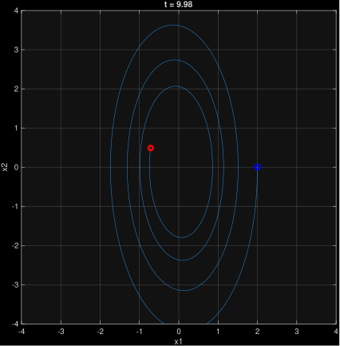
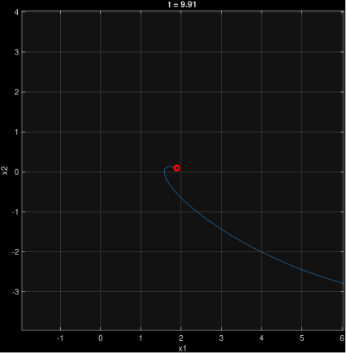
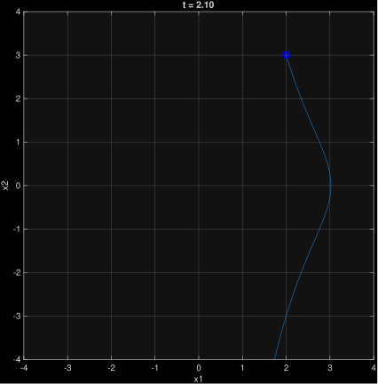

## Problem 1.(a):
substitute the given feedback control law $u = -2\dot{x}^3 - 5x|x| = -2x_2^3 - 5x_1|x_1|$ into the given system. Then get:

$$
\begin{aligned}
\dot{x}_1 &= x_2 \\
\dot{x}_2 &= -a_1 x_2^3 - a_2 x_1^2 - 2x_2^3 - 5x_1|x_1| \\
&= -(a_1 + 2)x_2^3 - a_2 x_1^2 - 5x_1|x_1|
\end{aligned}
$$

let the Lyapunov function to be :
$$
V(x_1, x_2) = \int_0^{x_1} (5s|s| + a_2 s^2) \, ds + \frac{a_1 + 2}{4}x_2^4
$$
since $a_1 >-2, \quad |a_2| < 5$:
$$
\int_0^{x_1} (5s|s| + a_2 s^2) \, ds >0 \\
\frac{a_1 + 2}{4}x_2^4 > 0
$$
$V(x_1, x_2)$ is positive definite.

$$
\dot{V}(x_1, x_2) = \frac{\partial V}{\partial x_1}\dot{x}_1 + \frac{\partial V}{\partial x_2}\dot{x}_2
$$

$$
\frac{\partial V}{\partial x_1} = 5x_1|x_1| + a_2 x_1^2 \quad \text{and} \quad \frac{\partial V}{\partial x_2} = x_2
$$

substitute $\dot{x_2}$:

$$
\dot{V}(x_1, x_2) = (5x_1|x_1| + a_2 x_1^2)x_2 + x_2 \left[ -(a_1 + 2)x_2^3 - a_2 x_1^2 - 5x_1|x_1| \right]
$$

which we get:
$$
\dot{V}(x_1, x_2) = -(a_1 + 2)x_2^4
$$
is negative semi- definite, it doesn't depend on $x_1$so it cana be 0, even wehen $x_1 \neq 0$. To prove asymptotic stability, we use LaSalle's principle:
1. Set $\dot{V}(x_1, x_2) = 0$, then $x_2 = 0$
2. Then $\dot{x}_2 = 0$
3. Then substitute into system dynamic:
$$
5x_1|x_1| + a_2 x_1^2 = 0
$$
4. solve for $x_1$, then get $x_1 = 0$

Hence, the only trajectory that can stay indefinitely in the set where $\dot{V} = 0$ is the origion itself:
$$
M = \{(0, 0)\}
$$

Since $V(x_1, x_2)$ is radially unbounded, positive definite, $\dot{V}(x_1, x_2) \leq 0$ and the largest inveriant set in $\dot{V} = 0$ is strically the origin (0,0), by LaSalle's inveriant principle, the origin is globally asymptotically stable.

---

## Problem 1.(b):
The candidate Lyapunove function is:

$$
V(t,x) = x_1^2 + [1+g(t)]^2x_2^2
$$

$g(t)$ is bounded by $0 \leq g(t) \leq k$,
which means $[1+g(t)]^2$ is bounded between 1 and $(1+k)^2$. Thus :
$$
x_1^2 + x_2^2 \leq V(t,x) \leq (1+k)^2(x_1^2 + x_2^2)
$$

$V(t,x)$ is positive definite and radially unbounded uniformly in $t$

is explicityly depends on time t through $g(t)$

Differentiate $V(t, x)$ with Respect to TimeSince $V(t, x)$ explicitly depends on time $t$ through $g(t)$:
$$
\dot{V}(t, x) = \frac{\partial V}{\partial t} + \frac{\partial V}{\partial x_1}\dot{x}_1 + \frac{\partial V}{\partial x_2}\dot{x}_2
$$

1. $\frac{\partial V}{\partial t} = 2[1 + g(t)]\dot{g}(t)x_2^2$
2. $\frac{\partial V}{\partial x_1} = 2x_1$
3. $\frac{\partial V}{\partial x_2} = 2[1 + g(t)]^2 x_2$

and substitude the system equations into this formula:

$$
\dot{V}(t, x) = 2[1 + g(t)]\dot{g}(t)x_2^2 + 2x_1\Big(-x_1 - g(t)x_2\Big) + 2[1 + g(t)]^2 x_2(x_1 - x_2)
$$

Since $\dot{g}(t) \leq g(t)$:
$$
\dot{V}(t, x) \leq -2x_1^2 + 2[1 + g(t) + g(t)^2]x_1x_2 - 2[1 + 2g(t) + g(t)^2]x_2^2 + 2[g(t) + g(t)^2]x_2^2
$$
$$
\dot{V}(t, x) \leq -2x_1^2 + 2[1 + g(t) + g(t)^2]x_1x_2 - 2[1 + g(t)]x_2^2
$$

$$
\dot{V}(t, x) \leq -\begin{bmatrix} x_1 & x_2 \end{bmatrix} \begin{bmatrix} 2 & -(1 + g(t) + g(t)^2) \\ -(1 + g(t) + g(t)^2) & 2(1 + g(t)) \end{bmatrix} \begin{bmatrix} x_1 \\ x_2 \end{bmatrix}
$$
The matrix $Q(t)$ must be uniformly positive definite, so that $\dot{V}(t,x)$ to be strictly negative definite uniformly. By using Sylvester's Criterion:
1. first minor: 2 > 0
2. Determinant of $Q(t)$:
$$\det(Q(t)) = 4 + 4g(t) - \left[1 + g(t) + g(t)^2\right]^2$$

if $g(t) \rightarrow 0$, $\det(Q(t)) = 3$, when $\det(Q) = 0$, $1 + g(t) + g(t)^2 = \sqrt{4+4g(t)}$, $\dot{V}(t,x)$ is negative definite. $g(t)$ is solved to be around 0.58, so if $k <0.58$, exists $c_3$ to have 

$$
c_3 = \frac{(4 + 2k) - \sqrt{(4 + 2k)^2 - 4\left[4 + 4k - (1 + k + k^2)^2\right]}}{2}
$$

$$
\dot{V}(t,x) \leq -c_3 \|x\|_2^2 = -c_3 (x_1^2 + x_2^2)
$$

$$
\dot{V} \leq -\frac{c_3}{(1+k)^2} V
$$

integral this formula, then get:

$$V(t, x(t)) \leq V(0, x(0)) \cdot e^{-\frac{c_3}{(1+k)^2} t}$$

---
## Problem 2:

### (i)
$\ddot{\theta}+\dot{\theta} + 0.5\theta = 0$

$\dot{x}_1 = x_2 \quad \dot{x}_2 = -0.5x_1-x_2$
$$
\begin{bmatrix} \dot{x}_1 \\ \dot{x}_2 \end{bmatrix} = \begin{bmatrix} 0 & 1 \\ -0.5 & -1 \end{bmatrix} \begin{bmatrix} x_1 \\ x_2 \end{bmatrix}
$$

Equilibrium point: $x = (0,0)$
LTI:  $\det(\lambda I - A) = 0$

$$
\det \begin{bmatrix} \lambda & -1 \\ 0.5 & \lambda + 1 \end{bmatrix} = \lambda^2 + \lambda + 0.5 = 0
$$
eigenvalues are:
$$\lambda_{1,2} = -0.5 \pm 0.5i$$, on left plane, Stable focus.

---

### (ii)
$\ddot{\theta} + \dot{\theta} + 0.5\,\theta = 1$

$$
\begin{aligned}
\dot{x}_1 &= x_2 \
\dot{x}_2 &= -0.5x_1 - x_2 + 1
\end{aligned}
$$

$$
\begin{bmatrix} \dot{x}_1 \\ \dot{x}_2 \end{bmatrix} = \begin{bmatrix} 0 & 1 \\ -0.5 & -1 \end{bmatrix} \begin{bmatrix} x_1 \\ x_2 \end{bmatrix} + \begin{bmatrix} 0 \\ 1 \end{bmatrix} \cdot 1
$$

Equilibrium point: $x = (2,0)$
LTI: same with above.

---

### (iii)

$\ddot{\theta} + (\dot{\theta})^2 + 0.5\,\theta = 0$

$$\ddot{\theta} = -0.5\,\theta - (\dot{\theta})^2$$

$$
\begin{aligned}
\dot{x}_1 &= x_2 \
\dot{x}_2 &= -0.5x_1 - x_2^2
\end{aligned}
$$

Equilibrium point: $x = (0,0)$
Calculate teh Jacobian around equilibrium:
$$
A = \begin{bmatrix} 0 & 1 \\-0.5 & 0 
\end{bmatrix}
$$
Eigenvalues are 
$$ \lambda_{1,2} = \pm \sqrt{0.5}i = \pm 0.707i$$
Real part is zero, so it's not possible to determine locally stability from linearization.

$$
V(x_1, x_2) = 0.25x_1^2 + 0.5x_2^2
$$

$$
\begin{align*}
\dot{V} &= \frac{\partial V}{\partial x_1}\dot{x}_1 + \frac{\partial V}{\partial x_2}\dot{x}_2 \\
&= -x_2^3
\end{align*}
$$
$x_2 < 0$，$\dot{V} = -x_2^3 > 0$, the total energy is increasing, by using LaSalle's Principle, it's not asymptically stable.

---
## Problem 3.

Poential energy is 
$$
V(q) = m_1 g_0 r_1 \sin{q_1} + m_2 g_0 (q_2+r_2)\sin(q_1)
$$

$$
g(q) = \frac{\partial V}{\partial q}
$$

$$
g(q) = \begin{bmatrix} (m_1 g_0 r_1+ m_2 g_0 (q_2+r_2)) \cos q_1 \\
m_2 g_0 \sin q_1
\end{bmatrix}
$$

$$
\frac{\partial g(q)}{\partial q} = 
\begin{bmatrix} -(m_1 g_0 r_1+ m_2 g_0 (q_2+r_2)) \sin q_1  & m_2 g_0 \cos q_1\\
m_2 g_0 \cos q_1 & 0
\end{bmatrix}
=
\begin{bmatrix} -\alpha \sin q_1  & b \cos q_1\\
b \cos q_1 & 0
\end{bmatrix}
$$
where define $\alpha = m_1 g r_1+m_2 g （q_2 + r_2）\quad b = m_2g_0$
$$
||\frac{\partial g(q)}{\partial q}||_2 = \sqrt{\lambda_{max}(J^TJ)}
$$
$$
\lambda_{max} = 1/2 * (a^2 \sin^2 q_1 +2b^2\cos^2q_1 + |a \sin q_1|\sqrt{a^2 \sin^2 q_1 + 4b^2 \cos^2 q_1})
$$
$$
\bar{a}^2 \sin^2(q_1) + 2b^2 \cos^2(q_1) \leq \bar{a}^2 (1) + 2b^2 (1) = \bar{a}^2 + 2b^2
$$

$$
\sqrt{\bar{a}^2 \sin^2(q_1) + 4b^2 \cos^2(q_1)} \leq \sqrt{\bar{a}^2 (1) + 4b^2 (1)} = \sqrt{\bar{a}^2 + 4b^2}
$$

$$
\lambda_{\max} \leq \frac{1}{2} \left( \bar{a}^2 + 2b^2 + \bar{a} \sqrt{\bar{a}^2 + 4b^2} \right)
$$

then we get:
$$
\alpha = \sqrt{\frac{1}{2} \left( \bar{a}^2 + 2b^2 + \bar{a} \sqrt{\bar{a}^2 + 4b^2} \right)}
$$
where, 
* $\bar{a} = g_0(m_1 r_1 + m_2 (L + r_2))$
* $b = g_0 m_2$