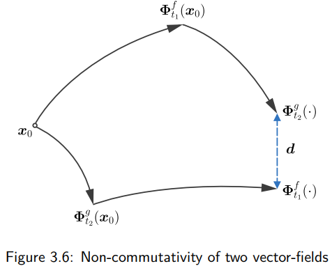
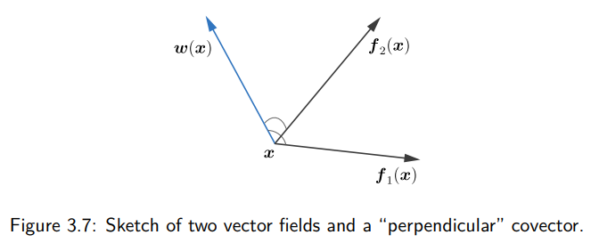
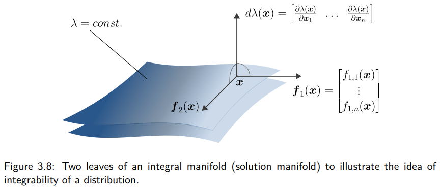

To characterize the evolution of the solutions of nonlinear control systems of the form:
$$
\dot{\boldsymbol{x}}(t) = \boldsymbol{f}(\boldsymbol{x}(t)) + \sum_{i=1}^{m} \boldsymbol{g}_i(\boldsymbol{x}(t))u_i(t). \tag{3.1}
$$
which are defined on a (differentiable) *manifold*（流形） $\mathcal{X} \subset \mathbb{R}^n$. We simply consider $\mathcal{X}$ as a possibly curved subspace of $\mathbb{R}^n$, without going into detail concerning the precise definition in terms of differential geometry (which contains coordinate charts, atlases, diffeomorphisms, etc.). We assume the values $u_i(t)$, $i = 1, \dots, m$ of the control inputs to be from an *admissible set*, which is expressed by $\boldsymbol{u} : [0, \infty) \rightarrow \mathcal{U} \subset \mathbb{R}^m$. The flow of (3.1) is induced by the *drift vector field* $\boldsymbol{f}$ and the *control vector fields* $\boldsymbol{g}_i$, $i = 1, \dots, m$.

向量场，在流形坐标点上的n维度向量

<strong>Drift Vector Field</strong>: 环境自带，控制输入为0时，系统的运动方向。 

<strong>Control Vector Field</strong>: 控制输入，通过不同控制量来改变风的方向，把系统推向想去的方向。

## 3.1 Vector Fields

First of all, we clarify our notion of *vector fields*, which are the objects on the right hand side of (3.1). They can clearly be understood as mappings from $\mathcal{X}$ to $\mathbb{R}^n$, i.e.,
$$
\boldsymbol{f} : \mathcal{X} \rightarrow \mathbb{R}^n, \quad \boldsymbol{g}_i : \mathcal{X} \rightarrow \mathbb{R}^n, \quad i = 1, \dots, m. \tag{3.2}
$$
The image spaces of these mappings can be, however, endowed with a more *geometric* meaning if we think of what these vector fields do: They induce the solutions of the state differential equation (3.1), depending on the initial value, i.e., the *flow* $\boldsymbol{x}(t) = \boldsymbol{\Phi}(\boldsymbol{x}_0, t)$. If we for the moment consider the unforced system, i.e., zero input $u_1 = \dots = u_m = 0$, then the drift vector field $\boldsymbol{f}$ can be understood in the following sense:

流： 状态微分方程的解轨迹

在不同时间点形成的连续曲线，在数学上叫做流，表示从初始位置x0出发，经过时间t之后的系统位置

向量场f就是流在当前位置的时间切线(Tangent Vector).

$$
\boldsymbol{f}(\boldsymbol{x}(t)) = \lim_{\varepsilon \rightarrow 0} \frac{\partial \boldsymbol{\Phi}(\boldsymbol{x}_0, t + \varepsilon)}{\partial \varepsilon}, \tag{3.3}
$$

We can understand the vector field as a mapping from the space $\mathcal{X}$, in which the solution is defined and evolves, to a space, which is tangent to this solution

If, as in the case of the control system, serveral vector fields induce (depending on the choice of the inputs), we can imagine that for every state $x \in \mathcal{X}$ the possible time derivatives $\dot{x}$ lie in a (hyper-)plane, which is tangent to all possible solutions $x$. The space $\mathcal{X} \subset \mathbb{R}^n$ can be a curved subspace, a (solution) manifold, and we can nicely illustrate the *tangent space* $T_{\boldsymbol{x}}\mathcal{X}$ at $\mathcal{X}$ in $\boldsymbol{x}$, see Fig. 3.2. Whenever we want to stress this geometric notion of a vector field, we write
$$
\boldsymbol{f} : \mathcal{X} \rightarrow T_{\boldsymbol{x}}\mathcal{X}, \quad \boldsymbol{g}_i : \mathcal{X} \rightarrow T_{\boldsymbol{x}}\mathcal{X}, \quad i = 1, \dots, m. \tag{3.4}
$$

Note that there is a tangent space in every point $\boldsymbol{x} \in \mathcal{X}$. Each tangent space has the structure of a *linear vector space*. The union of the tangent spaces in all points of $\mathcal{X}$ is called the *tangent bundle* $T\mathcal{X} = \cup_{\boldsymbol{x} \in \mathcal{X}} T_{\boldsymbol{x}}\mathcal{X}$.

## Lie Derivative

Directional derivative
**Definition 3.1 (Lie derivative).** Given a scalar function $h : \mathbb{R}^n \rightarrow \mathbb{R}$ and a vector field $\boldsymbol{f} : \mathbb{R}^n \rightarrow \mathbb{R}^n$. The *Lie derivative* or *directional derivative* of $h(\boldsymbol{x})$ in direction of the vector field $\boldsymbol{f}(\boldsymbol{x})$ is given by
$$
L_{\boldsymbol{f}}h(\boldsymbol{x}) = \frac{\partial h(\boldsymbol{x})}{\partial \boldsymbol{x}}\boldsymbol{f}(\boldsymbol{x}). \tag{3.5}
$$

**Example 3.1.** Given the scalar function (which could be a Lyapunov candidate)
$$
V(\boldsymbol{x}) = \frac{1}{2}x_1^2 + \frac{1}{2}x_2^2
$$
and the vector field (here constant)
$$
\boldsymbol{f}(\boldsymbol{x}) = \begin{bmatrix} 1 \\ 0 \end{bmatrix}.
$$
The Lie derivative of $V$ in direction of $\boldsymbol{f}$, which is nothing else than the rate of change of $V(\boldsymbol{x})$ along the flow induced by the vector field $\boldsymbol{f}$, is given by
$$
L_{\boldsymbol{f}}V(\boldsymbol{x}) = \begin{bmatrix} x_1 & x_2 \end{bmatrix} \begin{bmatrix} 1 \\ 0 \end{bmatrix} = x_1. \tag{3.6}
$$

**Homework:** Sketch the same with the vector field representing the dynamics of a damped oscillator (with unit parameter values)
$$
\boldsymbol{f}(\boldsymbol{x}) = \begin{bmatrix} 0 & 1 \\ -1 & -1 \end{bmatrix} \boldsymbol{x} = \begin{bmatrix} x_2 \\ -x_1 - x_2 \end{bmatrix}.
$$

|采样区域/轴线|坐标特征|向量场特征 f(x)|箭头的几何走向|
|:--|:--|:--|:--|
|正 x2​ 轴（正上方）|"x1​=0,x2​>0"|[x2​−x2​​]|向右下方 倾斜 45° 冲刺|
|正 x1​ 轴（正右方）|"x1​>0,x2​=0"|[0−x1​​]|垂直向下 动|
|负 x2​ 轴（正下方）|"x1​=0,x2​<0"|[x2​−x2​​]|向左上方 倾斜 45° 冲刺|
|负 x1​ 轴（正左方）|"x1​<0,x2​=0"|[0−x1​​]|垂直向上 动|

把全平面所有的箭头连起来，会发现它不再像上一题那样傻傻地全部往右吹，而是形成了一个顺时针旋转、并且不断向原点 $\mathbf{0}$ 靠拢的“漩涡”。

Lie Derivative:
$$
\begin{aligned}
L_{\boldsymbol{f}}V(\boldsymbol{x}) &= \frac{\partial V}{\partial \boldsymbol{x}}\boldsymbol{f}(\boldsymbol{x}) \\
&= \begin{bmatrix} x_1 & x_2 \end{bmatrix} \begin{bmatrix} x_2 \\ -x_1 - x_2 \end{bmatrix} \\
&= x_1 x_2 - x_2 x_1 - x_2^2 \\
&= -x_2^2
\end{aligned}
$$

这意味着系统的总能量在宏观上一直在减少,所以它始终在往碗底（原点）的方向偏转逃逸

## Duality and Contagent Space

> **Definition 3.2 (Vector space).** A linear vector space $V$ over the real numbers $\mathbb{R}$ (or another field) is a nonempty set with the operations addition $+ : V \times V \rightarrow V$ and scalar multiplication $\cdot : \mathbb{R} \times V \rightarrow V$. These two operations satisfy a set of properties: (i) commutativity, (ii) associativity, existence of (iii) a zero element and (iv) an inverse with respect to addition, (v) associativity and existence of (vi) a unit element with respect to scalar multiplication, as well as two distributivity properties (vii and viii), which combine addition and scalar multiplication.

We introduce *duality* on the example of Eq. (3.6), where we call
$$
\boldsymbol{w}(\boldsymbol{x}) = \begin{bmatrix} 2x_1 & 2x_2 \end{bmatrix}, \quad \boldsymbol{f}(\boldsymbol{x}) = \begin{bmatrix} 1 \\ 0 \end{bmatrix} \tag{3.7}
$$
*dual objects*, which is in accordance with the following definition:

> **Definition 3.3 (Dual vector space).** Given a vector space $V$. Its *dual space* $V^*$ is the space of all linear functionals $\varphi : V \rightarrow \mathbb{R}$ on $V$.

* Tangent Space $T_{\boldsymbol{x}}\mathcal{X}$ as column vectors
* Contangent Space $\frac{\partial V}{\partial \boldsymbol{x}}$ as row vectors, not  representing motions, but the environment。

Apparently, if we understand $\boldsymbol{f}(\boldsymbol{x})$ as column vector, i.e., an element of $\mathbb{R}^2$, and $\boldsymbol{w}(\boldsymbol{x})$ as a row vector, which then is an element of the dual space $(\mathbb{R}^2)^*$, the linear functional $\varphi$ can be written as a *duality pairing*, which is here the standard scalar product between row and column vectors; see (3.9) below.

### 3.3.1 Covectors or One-Forms

Consider Eq. (3.6). $L_{\boldsymbol{f}}h(\boldsymbol{x})$ can be understood as a linear functional on the tangent space $T_{\boldsymbol{x}}\mathcal{X}$: A vector $\boldsymbol{f}(\boldsymbol{x}) \in T_{\boldsymbol{x}}\mathcal{X}$ is mapped (by means of $\boldsymbol{w}(\boldsymbol{x})$) to the real numbers. Equivalently, this functional can be represented as a *duality product* or *duality pairing*
$$
\langle \cdot, \cdot \rangle : T^*_{\boldsymbol{x}}\mathcal{X} \times T_{\boldsymbol{x}}\mathcal{X} \rightarrow \mathbb{R} \tag{3.8}
$$
as follows:
$$
L_{\boldsymbol{f}}h(\boldsymbol{x}) = \langle \boldsymbol{w}(\boldsymbol{x}), \boldsymbol{f}(\boldsymbol{x}) \rangle = \sum_{i=1}^{2} w_i(\boldsymbol{x})f_i(\boldsymbol{x}) \quad \text{with} \quad \boldsymbol{w}(\boldsymbol{x}) = \frac{\partial h(\boldsymbol{x})}{\partial \boldsymbol{x}}. \tag{3.9}
$$

把右边的向量f,塞进左边的线性函数w的输入框里，吐出一个实数
* Covector 特定点x处的对偶行向量
* Differential 1-form 如果在真个流空间内的每一个点都定义了一个余切向量，就变成了一个场，叫做1-form

In the duality product, the vector $\boldsymbol{f}(\boldsymbol{x})$ is paired with its dual object $\boldsymbol{w}(\boldsymbol{x})$, which we call a *covector* or *(differential) one-form*. While we think of $\boldsymbol{f}(\boldsymbol{x})$ "living" in the tangent space $T_{\boldsymbol{x}}\mathcal{X}$, we can consider its dual object $\boldsymbol{w}(\boldsymbol{x})$ to live on the *cotangent space* $T^*_{\boldsymbol{x}}\mathcal{X}$.

In the above example, $\boldsymbol{w}(\boldsymbol{x})$ is a special one-form, a so-called *exact differential*. The components of $\boldsymbol{w}(\boldsymbol{x})$ are obtained from differentiation of a scalar function:
$$
\boldsymbol{w}(\boldsymbol{x}) = \begin{bmatrix} w_1(\boldsymbol{x}) & w_2(\boldsymbol{x}) \end{bmatrix} = \begin{bmatrix} \frac{\partial h(\boldsymbol{x})}{\partial x_1} & \frac{\partial h(\boldsymbol{x})}{\partial x_2} \end{bmatrix} =: \text{d}h(\boldsymbol{x}). \tag{3.10}
$$

Equation (3.9), and therefore the definition of the Lie derivative, can be rewritten as the *duality pairing* of a vector field with the *exact differential* of a scalar function:
$$
L_{\boldsymbol{f}}h(\boldsymbol{x}) = \langle \text{d}h(\boldsymbol{x}), \boldsymbol{f}(\boldsymbol{x}) \rangle. \tag{3.11}
$$

看3.5就可以理解这里的写法了。

### 3.3.2 Bases of the Tangent and Cotangent Space

Consider again the definition of the Lie derivative. By writing
$$
\begin{aligned}
L_{\boldsymbol{f}}h(\boldsymbol{x}) &= \begin{bmatrix} \frac{\partial h(\boldsymbol{x})}{\partial x_1} & \dots & \frac{\partial h(\boldsymbol{x})}{\partial x_n} \end{bmatrix} \begin{bmatrix} f_1(\boldsymbol{x}) \\ \vdots \\ f_n(\boldsymbol{x}) \end{bmatrix} \\
&= \left( f_1(\boldsymbol{x})\frac{\partial}{\partial x_1} + \dots + f_n(\boldsymbol{x})\frac{\partial}{\partial x_n} \right) (h(\boldsymbol{x})),
\end{aligned} \tag{3.12}
$$
a vector field $\boldsymbol{f}(\boldsymbol{x})$ can be understood as a first order partial differential operator, which acts on a real-valued function $h(\boldsymbol{x})$. Hence, it makes sense to define $\left\{ \frac{\partial}{\partial x_1}, \dots, \frac{\partial}{\partial x_n} \right\}$ as the *basis of the tangent space*. In this basis, a vector $\boldsymbol{f}(\boldsymbol{x})$ is written
$$
\boldsymbol{f}(\boldsymbol{x}) = f_1(\boldsymbol{x})\frac{\partial}{\partial x_1} + \dots + f_n(\boldsymbol{x})\frac{\partial}{\partial x_n}. \tag{3.13}
$$

Consider the rate of change of a scalar function $h : \mathcal{X} \rightarrow \mathbb{R}$ along the solutions of a system $\dot{\boldsymbol{x}} = \boldsymbol{f}(\boldsymbol{x}) + \boldsymbol{g}(\boldsymbol{x})u$. Assume that, as indicated in Fig. 3.2, the solutions evolve for arbitrary inputs $u(t)$ on a 2-dimensional integral (solution) manifold of $\mathcal{X} \subset \mathbb{R}^3$, on which $h(\boldsymbol{x}_0) = h(\boldsymbol{x}(t)) = \textit{const.}$ holds. Equivalently, $\dot{h} = 0$ along the flow $\boldsymbol{\Phi}(\boldsymbol{x}_0, t)$. We now write the difference $h(\boldsymbol{x}(\varepsilon)) - h(\boldsymbol{x}(0)) = 0$ on a small time interval $[0, \varepsilon]$, and thereby highlight the basis elements of the cotangent space and justify the notion and notation of an exact differential:

$$
\begin{aligned}
0 &= \int_{0}^{\varepsilon} \dot{h}(\boldsymbol{x}(t))\text{d}t \\
&= \int_{0}^{\varepsilon} \begin{bmatrix} \frac{\partial h}{\partial x_1} & \frac{\partial h}{\partial x_2} & \frac{\partial h}{\partial x_3} \end{bmatrix} \begin{bmatrix} \frac{\text{d}x_1}{\text{d}t} \\ \frac{\text{d}x_2}{\text{d}t} \\ \frac{\text{d}x_3}{\text{d}t} \end{bmatrix} \text{d}t \\
&= \int_{\boldsymbol{x}(0)}^{\boldsymbol{x}(\varepsilon)} \begin{bmatrix} \frac{\partial h}{\partial x_1} & \frac{\partial h}{\partial x_2} & \frac{\partial h}{\partial x_3} \end{bmatrix} \begin{bmatrix} \text{d}x_1 \\ \text{d}x_2 \\ \text{d}x_3 \end{bmatrix} & \text{d}x_i \text{: differentials of coordinate functions} \\
&= \int_{h(\boldsymbol{x}(0))}^{h(\boldsymbol{x}(\varepsilon))} \text{d}h & \text{d}h \text{: differential/increment of } h \text{ along the path} \\
&= h(\boldsymbol{x}(\varepsilon)) - h(\boldsymbol{x}(0))
\end{aligned} \tag{3.14}
$$

* 坐标轴方向的偏导算子$\frac{\partial}{\partial x_i}$，充当了该方向上的单位方向基底，向量的分量 $f_i(\boldsymbol{x})$ 就是在该基底下的投影坐标。

* 余切空间是切空间的对偶空间，里面全是行向量（用来和列向量做内积，给列向量打分）。既然切空间的基底是 $\frac{\partial}{\partial x_i}$，那么根据对偶性，余切空间的基底必须满足两者的乘积（对偶配对）能够抵消，吐出单位 1。

坐标函数的微分 $\text{d}x_i$ 刚好完美符合这一天性：$$\langle \text{d}x_i, \frac{\partial}{\partial x_j} \rangle = \frac{\partial x_i}{\partial x_j} = \begin{cases} 1 & i = j \\ 0 & i \neq j \end{cases}$$

改变坐标系，本质上就是改变了切空间的基底 $\frac{\partial}{\partial x_i}$ 以及余切空间的基底 $\text{d}x_i$

很多非线性控制器的推导（比如大名鼎鼎的 反馈线性化 Feedback Linearization），其核心底层就是通过寻找一组恰当的微分一形式（余切基底 $\text{d}h$），去和系统的非线性控制向量场进行配对消去，从而在几何上把一个弯曲的非线性流形系统，“铺平”成一个直线的线性系统

*Remark 3.1.* An interpretation why $\{\text{d}x_1, \dots, \text{d}x_n\}$ is the natural basis for the space of one-forms on $\mathbb{R}^n$ is as follows. Consider the interval $I = [a, b] \subset \mathbb{R}$ with the single *spatial* coordinate $x \in I \subset \mathbb{R}$ and the exact differential （1-form）
$$
\text{d}Q = \frac{\partial Q(x)}{\partial x}\text{d}x.
$$

This exact differential can describe the distribution of charge on an electric transmission line, with $\frac{\partial Q(x)}{\partial x} = \rho(x)$ the charge density per length.
$$
Q_{ab} = \int_{I}\text{d}Q = \int_{a}^{b} \frac{\partial Q(x)}{\partial x}\text{d}x
$$
then represents the total charge, which is obtained *by integration* over $I$. How is the total charge on a transmission line influenced (if we neglect distributed currents to ground)? Only by the currents injected at the two terminals:
内部变化率取决于两端及分量的差，与系统边界相关
$$
\frac{\text{d}}{\text{t}}Q_{ab} = I_a - I_b.
$$

This is an *integral conservation law* for the charge and a 1D example for a class of systems that can be modelled in a physically intuitive and natural way in the language of differential forms (of degree $k$ in general – $k$-forms), see e.g., [1]. Maxwell’s equations, heat transfer and fluid dynamical problems are further examples on higher-dimensional spatial domains.

## 3.4 Lie bracket

Lie bracket gives an answer to what occurs, when two vector fields interact. We will introduce the idea behind the Lie bracket at an everyday life situation:

> **Example 3.2 (Parking a car in a parallel parking lot).** Assume you want to bring your car from the initial position $A$ to the final position $C$ as depicted in Fig. 3.4, knowing that your car doesn't allow a direct parallel shift by the available controls due to the kinematic constraints. What you do, is the following sequence of actions.
> 
> 1. Go back, steer right,
> 2. go back, steer left,
> 3. go forward, steer right (= do the "inverse" of 2.),
> 4. go forward, steer left (= do the "inverse" of 1.).
> 
> The result of this maneuver is the desired parallel shift of the vehicle, a motion which can *not* be realized *directly*. $\triangleleft$

The example illustrates an important point in nonlinear systems:
> In nonlinear systems, in general, the order of subsequently applying (control) vector fields plays an important role and can be used to generate new vector fields / directions of motion.

We would like to abstract from the car parking problem and investigate the solution of the following switched system.
$$
\dot{\boldsymbol{x}} = \begin{cases}
\boldsymbol{f}(\boldsymbol{x}), & 0 \le t < \Delta t, \\
\boldsymbol{g}(\boldsymbol{x}), & \Delta t \le t < 2\Delta t, \\
-\boldsymbol{f}(\boldsymbol{x}), & 2\Delta t \le t < 3\Delta t, \\
-\boldsymbol{g}(\boldsymbol{x}), & 3\Delta t \le t < 4\Delta t.
\end{cases} \tag{3.17}
$$

For intervals of time $\Delta t$, two vector fields, with positive and negative sign each, are subsequently applied and induce the solution $\boldsymbol{x}(t)$. If one lets $\Delta t \rightarrow 0$, then an interesting question is whether the final value $\boldsymbol{x}(4\Delta t)$ equals the initial value $\boldsymbol{x}(0)$ or not.

通过“交互摩擦”产生的全新向量场，就是李括号（Lie Bracket），记作：
$$[\boldsymbol{f}, \boldsymbol{g}]$$
* 它的本质： 是两个向量场的非线性算子乘积差：$[\boldsymbol{f}, \boldsymbol{g}] = \nabla \boldsymbol{g} \cdot \boldsymbol{f} - \nabla \boldsymbol{f} \cdot \boldsymbol{g}$。
* 它的物理意义： 代表通过交替激活两个现有的控制输入（前后、左右），系统实质上获得了解锁隐藏的、第三个独立控制自由度（横移）的能力

*Example 3.3 (Constant vector fields).* Consider the two constant vector fields
$$
\boldsymbol{f} = \begin{bmatrix} 1 \\ 1 \end{bmatrix}, \quad \boldsymbol{g} = \begin{bmatrix} 1 \\ -1 \end{bmatrix},
$$
and let $\Delta t = 1$. As an alternative to the sequence of vector fields as described in Eq. (3.17), one could also do as follows: Start from an initial value and apply first $\boldsymbol{f}$, then $\boldsymbol{g}$. Then, start from the same initial value and permute the sequence of the vector fields, i.e., start with $\boldsymbol{g}$ and then apply $\boldsymbol{f}$. Figure 3.5 depicts the solutions of the differential equations for the two constant vector fields in this scenario. Both solutions end at the same point, they *commute*.

In the case of constant vectors $\boldsymbol{f}$ and $\boldsymbol{g}$, we have
$$
\boldsymbol{\Phi}_{t_2}^{\boldsymbol{g}}(\boldsymbol{\Phi}_{t_1}^{\boldsymbol{f}}(\boldsymbol{x}_0)) = \boldsymbol{\Phi}_{t_1}^{\boldsymbol{f}}(\boldsymbol{\Phi}_{t_2}^{\boldsymbol{g}}(\boldsymbol{x}_0)), \tag{3.18}
$$
which can be read as follows: $\boldsymbol{\Phi}_{t_1}^{\boldsymbol{f}}(\boldsymbol{x}_0)$ is the solution of $\dot{\boldsymbol{x}} = \boldsymbol{f}(\boldsymbol{x})$, starting at $\boldsymbol{x}_0$ and evaluated at time $t_1$, or alternatively, the *flow* induced by the vector field $\boldsymbol{f}$. $\triangleleft$

What we observed for constant vector fields, is not true in general for non-constant vector fields. The situation then is sketched in Fig. 3.6.

> **Definition 3.4 (Lie bracket).** The *Lie bracket*
> $$
> [\boldsymbol{f}(\boldsymbol{x}), \boldsymbol{g}(\boldsymbol{x})] := \frac{\partial \boldsymbol{g}(\boldsymbol{x})}{\partial \boldsymbol{x}}\boldsymbol{f}(\boldsymbol{x}) - \frac{\partial \boldsymbol{f}(\boldsymbol{x})}{\partial \boldsymbol{x}}\boldsymbol{g}(\boldsymbol{x}). \tag{3.19}
> $$
> is a measure for the *non-commutativity* of vector fields. If the Lie bracket of two vector fields is zero, we say that their flows commute.

Commutavity: $g(f(x)) = f(g(x))$, 运用两个vector field的结束位置相同

Non-Commutavity:

The Lie bracket can point into a new direction that can not be represented by the original vector fields. This is the property which allows parking a car in a parallel parking lot!

If the Lie bracket of two vector fields $\boldsymbol{f}(\boldsymbol{x})$ and $\boldsymbol{g}(\boldsymbol{x})$ is zero, then the flows of the two vector fields *commute*. This is a very rare situation, which occurs for example if the two vector fields are constant, $\boldsymbol{f} = \textit{const.}$, $\boldsymbol{g} = \textit{const.}$

For two linear vector fields $\boldsymbol{f}(\boldsymbol{x}) = \boldsymbol{A}\boldsymbol{x}$ and $\boldsymbol{g}(\boldsymbol{x}) = \boldsymbol{B}\boldsymbol{x}$, one might think that the Lie bracket
$$
[\boldsymbol{A}\boldsymbol{x}, \boldsymbol{B}\boldsymbol{x}] \tag{3.20}
$$
lies in $\text{span}\{\boldsymbol{A}\boldsymbol{x}, \boldsymbol{B}\boldsymbol{x}\}$. This is, however, *not true in general*.

## 3.5 Distributions and involutivity
### Distribution
Given a set of $k$ vector fields $f_1(x), \dots, f_k(x) \in T_x\mathcal{X}$. At every point $x \in \mathcal{X}$, these vector fields span a subspace of the tangent space:

$$\Delta(x) := \text{span}\{f_1(x), f_2(x), \dots, f_k(x)\} \subset T_x\mathcal{X} \quad \text{(3.21)}$$

> **Definition 3.5 (Distribution)**
> The assignment of a set of vector fields to the corresponding subspace of $T_x\mathcal{X}$ at every point of $\mathcal{X}$ is called a **distribution** and denoted as:
> $$\Delta = \text{span}\{f_1, \dots, f_k\} \quad \text{(3.22)}$$
Distribution 空间的每一个点上都指定一个允许运动子空间

The **dimension** of $\Delta$ at a specific point $x$ is defined using the matrix rank:

$$\text{dim}(\Delta(x)) := \text{rank}[f_1(x), \dots, f_k(x)] \quad \text{(3.23)}$$

The dimension of $\Delta$ may vary across the state space $\mathcal{X}$. However, if for all $x \in \mathcal{X}$, the vector fields $f_1(x), \dots, f_k(x)$ are **linearly independent**, then the matrix on the right-hand side of Equation (3.23) has a full rank of $k$ at every point $x \in \mathcal{X}$:

$$\text{dim}(\Delta(x)) = k = \text{const.} \quad \text{on } \mathcal{X} \quad \text{(3.24)}$$

In this case, we call the distribution $\Delta$ **nonsingular**.

在k个矢量场空间中任何地方都是线性无关的，意味在任何地方，子空间维度永远是固定常数k，
这种维数处处相等，表现良好的分布就叫非奇异分布.
在一个smooth的vector field $f_i(x)$ 中
如果一个新的vector field g(x)属于这个非奇异分布，意味着g(x)代表的运动方向完全在系统的控制能力之内，可以被现有的基本矢量场f(x)组合出来。

$$g(x) = \sum_{i=1}^k c_i(x)f_i(x) \quad \text{(3.25)}$$
这里的$c_i(x)$跟随位置变化，意味着输入控制量（smooth）

### Involutive Closure
对合闭包
> **Definition 3.6 (Involutive distribution)**
> A $k$-dimensional distribution $\Delta$ is called **involutive** if the following implication holds for all $i, j \in \{1, \dots, k\}$:
> 
> $$f_i, f_j \in \Delta \implies [f_i, f_j] \in \Delta \quad \text{(3.26)}$$

Definition 3.6： 如果一个分布 $\Delta$ 是对合（Involutive）的，意味着无论你把分布里的哪两个矢量场拿来做李括号运算，算出来的新矢量场 $[f_i, f_j]$ 依然在原本的分布 $\Delta$ 里面。

如果一个初始分布不是involutive，可以通过Lie Bracket来推导出原本没有的方向。然后不但推导出更多方向，直到推导不出更多方向为止。

$$\bar{\Delta} = \text{span}\{f_1, \dots, f_k, \underbrace{[f_i, f_j]}_{\notin \Delta}, \dots\} \quad \text{(3.27)}$$
### Annihilator of Distribution
零化子 (Annihilator) $\Delta^\perp$, 是正交补空间在对偶空间的延申。

$$\Delta^\perp = \text{span}\{w \in T^*\mathcal{X} \mid \langle w, f_i \rangle = 0, \;\; f_i \in \Delta\} \quad \text{(3.28)}$$
>
在微分几何中，我们不用普通的向量来表示法方向，而是用余矢量（Covector / 一次微分形式 one-form）。这个特殊的余矢量 $w$ 与平面内任何向量的内积（对偶积）都为 $0$：$$\langle w, f_1 \rangle = 0, \quad \langle w, f_2 \rangle = 0$$
所有这样的余矢量撑起的空间，就叫做零化子 $\Delta^\perp$。
维数公式 $\text{dim}(\Delta^\perp) = n - k$： 如果系统总空间有 $n$ 维，你当前能运动的自由度有 $k$ 个，那么剩下的 $n-k$ 个方向就是你无法直接突破的物理限制（约束）。

*Note on Figure 3.7:* The illustration shows $\Delta = \text{span}\{f_1, f_2\}$ with $f_1, f_2 \in \mathbb{R}^3$ vectors in Euclidean space. The annihilator $\Delta^\perp = \text{span}\{w\}$ consists of a single covector which can be drawn perpendicular to the plane spanned by $f_1$ and $f_2$. (The duality products of $f_1$ and $f_2$ with $w$, which correspond to scalar products in $\mathbb{R}^3$ in the illustration, are zero.)

## 3.6 Integrability and Frobenius' Theorem
We introduce a theorem which is of fundamental importance in differential geometric methods for control and observer design.

> **Definition 3.8 (Complete integrability)**
> If the annihilator $\Delta^\perp$ of a distribution $\Delta$ is spanned by **exact differentials**, then the distribution is called **completely integrable**.

 如果零化子 $\Delta^\perp$ 可以完全由恰当微分 (Exact Differentials) $d\lambda(x)$ 撑开，也就是说，所有的限制都可以写成某个标量函数 $\lambda(x) = C$（常数）的导数形式，这就叫完全可积。

Recall that we defined an *exact differential* as a covector whose components are the partial derivatives of a scalar function $\lambda(x)$:

$$d\lambda(x) = \frac{\partial \lambda}{\partial x_1}dx_1 + \dots + \frac{\partial \lambda}{\partial x_n}dx_n \quad \text{(3.29)}$$

### Interpretation of complete integrability
Consider **Figure 3.8**, where the distribution $\Delta$ comprises two vector fields $f_1$ and $f_2$. The condition for complete integrability states that there exists a scalar function $\lambda : \mathbb{R}^3 \to \mathbb{R}$ such that:

$$\langle d\lambda(x), f_i(x) \rangle = \frac{\partial \lambda(x)}{\partial x} f_i(x) = L_{f_i}\lambda(x) = 0 \quad (\text{for } i = 1,2)$$

Where $L_{f_i}\lambda(x)$ denotes the **Lie derivative** of $\lambda(x)$ along the vector field $f_i(x)$.

* $d\lambda(x)$ 是标量函数 $\lambda(x)$ 的梯度（法向量）。
* 这个等式表明系统自带的运动矢量场 $f_1(x)$ 和 $f_2(x)$，与这个梯度向量处处垂直（内积为 0）
* 李导数 $L_{f_i}\lambda(x) = 0$ 的物理含义： 如果你沿着系统允许的运动方向 $f_1$ 或 $f_2$ 移动，标量函数 $\lambda(x)$ 的数值绝对不会发生任何变化。

Foliation 叶层上有无数个Leaves，叶面上 $\lambda(x) = c \quad (\text{常数})$ ，当系统从初始点出发时，等于被出生点所在的特定叶子定义。由于运动方向永远与曲面法向线垂直，所以系统只能在弯曲的纸面上滑行，无法跳跃到其他Leaves上。  

如果一个分布 $\Delta = \text{span}\{f_1, \dots, f_k\}$ 是完全可积的，那么就一定能找到 $n-k$ 个独立的约束函数 $\lambda_j(x)$。这些函数构成了一个偏微分方程组：$$\frac{\partial \lambda_j(x)}{\partial x} f_i(x) = 0$$ 说明系统被 $n-k$ 张宏观大网给死死罩住了，它实际活动的范围被降维成了一个 $k$ 维的曲面

A necessary and sufficient condition for a distribution to form a macroscopically confined integral manifold is given by the celebrated **Frobenius' Theorem**:

> ### **Theorem 3.1 (Frobenius)**
> A distribution $\Delta = \text{span}\{f_1, \dots, f_k\}$ is **completely integrable** if and only if it is **involutive**.

在此之前，如果你想知道一个系统会不会被困在某个宏观曲面上（完全可积），你必须去求解极其恶心的偏微分方程组（PDEs）（即公式 3.31）。这在数学上通常是很难甚至无解的。只需要把这几个控制矢量场两两拿出来求一下偏导数、做下代数运算（算李括号 $[f_i, f_j]$）。如果算出来的新方向都在原空间里，那宏观曲面就必然存在！

### **Key Implications for Control Theory:**
* **Algorithmic Check:** It allows for an easy check of complete integrability. Instead of solving a complex system of partial differential equations (PDEs), one only needs to verify if the Lie brackets of all base vector fields stay within $\Delta$.
* **The Trapped State:** If the involutive closure $\bar{\Delta}$ satisfies $\text{dim}(\bar{\Delta}) < n$, an integral manifold of a dimension less than $n$ exists, and the system trajectories are trapped on it. 
* **The Fully Controllable State:** If $\text{dim}(\bar{\Delta}) = n$, no confining function $\lambda(x)$ exists. The "integral manifold" expands to the entire state space, meaning the system can potentially reach any state (fully accessible).

---

### 3.6.2 Straightening Out of Vector Fields

If and only if a $k$-dimensional distribution $\Delta = \text{span}\{f_1, \dots, f_k\}$ is involutive, the local coordinates can be fundamentally transformed to simplify the system representation.

如果系统满足involutive，则系统运行在某个leaf上，我们可以将曲面拉直，更好控制。

### **Coordinate Transformation (Diffeomorphism)**
Under a smooth, invertible coordinate transformation:
$$z = s(x) \quad \text{(3.32)}$$

The original vector fields $f_i(x)$, expressed via partial derivative bases as:
$$f_i(x) = \sum_{j=1}^n f_{ij}(x)\frac{\partial}{\partial x_j} \quad \text{(3.33)}$$

can be **straightened out** and transformed into a new coordinate frame $z$ as:
$$\tilde{f}_i(z) = \sum_{j=1}^k \tilde{f}_{ij}(z)\frac{\partial}{\partial z_j} \quad \text{(3.34)}$$

*(where $f_{ij}$ denotes the $j$-th component of the vector $f_i$).*

n-k作为系统的constrain，作为0来看待，$z_1, \dots, z_k$：系统真正能动、能控制的有效状态。

> 📌 **Crucial Mathematical Insight:**
> Notice that the upper bound of the summation in the transformed vector field (3.34) drops from $n$ to $k$. This implies that the vector fields inducing the system flow have **exactly zero components** in the $n - k$ constrained directions (e.g., the $\frac{\partial}{\partial z_3}$ direction in Figure 3.9). The complex curved manifold is mathematically "flattened".