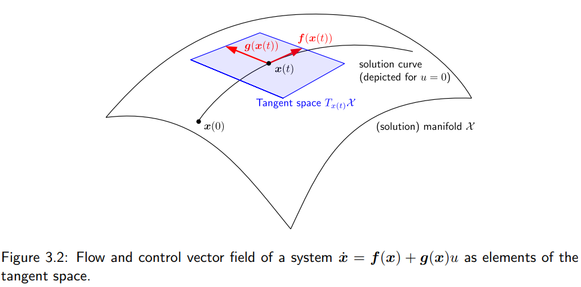

To characterize the evolution of the solutions of nonlinear control systems of the form:
$$
\dot{\boldsymbol{x}}(t) = \boldsymbol{f}(\boldsymbol{x}(t)) + \sum_{i=1}^{m} \boldsymbol{g}_i(\boldsymbol{x}(t))u_i(t). \tag{3.1}
$$
which are defined on a (differentiable) *manifold*（流形） $\mathcal{X} \subset \mathbb{R}^n$. We simply consider $\mathcal{X}$ as a possibly curved subspace of $\mathbb{R}^n$, without going into detail concerning the precise definition in terms of differential geometry (which contains coordinate charts, atlases, diffeomorphisms, etc.). We assume the values $u_i(t)$, $i = 1, \dots, m$ of the control inputs to be from an *admissible set*, which is expressed by $\boldsymbol{u} : [0, \infty) \rightarrow \mathcal{U} \subset \mathbb{R}^m$. The flow of (3.1) is induced by the *drift vector field* $\boldsymbol{f}$ and the *control vector fields* $\boldsymbol{g}_i$, $i = 1, \dots, m$.

向量场，在流形坐标点上的n维度向量

<strong>Drift Vector Field</strong>: 环境自带，控制输入为0时，系统的运动方向。 

<strong>Control Vector Field</strong>: 控制输入，通过不同控制量来改变风的方向，把系统推向想去的方向。

## 3.1 Vector Fields

First of all, we clarify our notion of *vector fields*, which are the objects on the right hand side of (3.1). They can clearly be understood as mappings from $\mathcal{X}$ to $\mathbb{R}^n$, i.e.,
$$
\boldsymbol{f} : \mathcal{X} \rightarrow \mathbb{R}^n, \quad \boldsymbol{g}_i : \mathcal{X} \rightarrow \mathbb{R}^n, \quad i = 1, \dots, m. \tag{3.2}
$$
The image spaces of these mappings can be, however, endowed with a more *geometric* meaning if we think of what these vector fields do: They induce the solutions of the state differential equation (3.1), depending on the initial value, i.e., the *flow* $\boldsymbol{x}(t) = \boldsymbol{\Phi}(\boldsymbol{x}_0, t)$. If we for the moment consider the unforced system, i.e., zero input $u_1 = \dots = u_m = 0$, then the drift vector field $\boldsymbol{f}$ can be understood in the following sense:

流： 状态微分方程的解轨迹

在不同时间点形成的连续曲线，在数学上叫做流，表示从初始位置x0出发，经过时间t之后的系统位置

向量场f就是流在当前位置的时间切线(Tangent Vector).

$$
\boldsymbol{f}(\boldsymbol{x}(t)) = \lim_{\varepsilon \rightarrow 0} \frac{\partial \boldsymbol{\Phi}(\boldsymbol{x}_0, t + \varepsilon)}{\partial \varepsilon}, \tag{3.3}
$$

We can understand the vector field as a mapping from the space $\mathcal{X}$, in which the solution is defined and evolves, to a space, which is tangent to this solution

If, as in the case of the control system, serveral vector fields induce (depending on the choice of the inputs), we can imagine that for every state $x \in \mathcal{X}$ the possible time derivatives $\dot{x}$ lie in a (hyper-)plane, which is tangent to all possible solutions $x$. The space $\mathcal{X} \subset \mathbb{R}^n$ can be a curved subspace, a (solution) manifold, and we can nicely illustrate the *tangent space* $T_{\boldsymbol{x}}\mathcal{X}$ at $\mathcal{X}$ in $\boldsymbol{x}$, see Fig. 3.2. Whenever we want to stress this geometric notion of a vector field, we write
$$
\boldsymbol{f} : \mathcal{X} \rightarrow T_{\boldsymbol{x}}\mathcal{X}, \quad \boldsymbol{g}_i : \mathcal{X} \rightarrow T_{\boldsymbol{x}}\mathcal{X}, \quad i = 1, \dots, m. \tag{3.4}
$$

Note that there is a tangent space in every point $\boldsymbol{x} \in \mathcal{X}$. Each tangent space has the structure of a *linear vector space*. The union of the tangent spaces in all points of $\mathcal{X}$ is called the *tangent bundle* $T\mathcal{X} = \cup_{\boldsymbol{x} \in \mathcal{X}} T_{\boldsymbol{x}}\mathcal{X}$.

## Lie Derivative

Directional derivative
**Definition 3.1 (Lie derivative).** Given a scalar function $h : \mathbb{R}^n \rightarrow \mathbb{R}$ and a vector field $\boldsymbol{f} : \mathbb{R}^n \rightarrow \mathbb{R}^n$. The *Lie derivative* or *directional derivative* of $h(\boldsymbol{x})$ in direction of the vector field $\boldsymbol{f}(\boldsymbol{x})$ is given by
$$
L_{\boldsymbol{f}}h(\boldsymbol{x}) = \frac{\partial h(\boldsymbol{x})}{\partial \boldsymbol{x}}\boldsymbol{f}(\boldsymbol{x}). \tag{3.5}
$$

**Example 3.1.** Given the scalar function (which could be a Lyapunov candidate)
$$
V(\boldsymbol{x}) = \frac{1}{2}x_1^2 + \frac{1}{2}x_2^2
$$
and the vector field (here constant)
$$
\boldsymbol{f}(\boldsymbol{x}) = \begin{bmatrix} 1 \\ 0 \end{bmatrix}.
$$
The Lie derivative of $V$ in direction of $\boldsymbol{f}$, which is nothing else than the rate of change of $V(\boldsymbol{x})$ along the flow induced by the vector field $\boldsymbol{f}$, is given by
$$
L_{\boldsymbol{f}}V(\boldsymbol{x}) = \begin{bmatrix} x_1 & x_2 \end{bmatrix} \begin{bmatrix} 1 \\ 0 \end{bmatrix} = x_1. \tag{3.6}
$$

**Homework:** Sketch the same with the vector field representing the dynamics of a damped oscillator (with unit parameter values)
$$
\boldsymbol{f}(\boldsymbol{x}) = \begin{bmatrix} 0 & 1 \\ -1 & -1 \end{bmatrix} \boldsymbol{x} = \begin{bmatrix} x_2 \\ -x_1 - x_2 \end{bmatrix}.
$$

|采样区域/轴线|坐标特征|向量场特征 f(x)|箭头的几何走向|
|:--|:--|:--|:--|
|正 x2​ 轴（正上方）|"x1​=0,x2​>0"|[x2​−x2​​]|向右下方 倾斜 45° 冲刺|
|正 x1​ 轴（正右方）|"x1​>0,x2​=0"|[0−x1​​]|垂直向下 动|
|负 x2​ 轴（正下方）|"x1​=0,x2​<0"|[x2​−x2​​]|向左上方 倾斜 45° 冲刺|
|负 x1​ 轴（正左方）|"x1​<0,x2​=0"|[0−x1​​]|垂直向上 动|

把全平面所有的箭头连起来，会发现它不再像上一题那样傻傻地全部往右吹，而是形成了一个顺时针旋转、并且不断向原点 $\mathbf{0}$ 靠拢的“漩涡”。

Lie Derivative:
$$
\begin{aligned}
L_{\boldsymbol{f}}V(\boldsymbol{x}) &= \frac{\partial V}{\partial \boldsymbol{x}}\boldsymbol{f}(\boldsymbol{x}) \\
&= \begin{bmatrix} x_1 & x_2 \end{bmatrix} \begin{bmatrix} x_2 \\ -x_1 - x_2 \end{bmatrix} \\
&= x_1 x_2 - x_2 x_1 - x_2^2 \\
&= -x_2^2
\end{aligned}
$$

这意味着系统的总能量在宏观上一直在减少,所以它始终在往碗底（原点）的方向偏转逃逸

## Duality and Contagent Space

> **Definition 3.2 (Vector space).** A linear vector space $V$ over the real numbers $\mathbb{R}$ (or another field) is a nonempty set with the operations addition $+ : V \times V \rightarrow V$ and scalar multiplication $\cdot : \mathbb{R} \times V \rightarrow V$. These two operations satisfy a set of properties: (i) commutativity, (ii) associativity, existence of (iii) a zero element and (iv) an inverse with respect to addition, (v) associativity and existence of (vi) a unit element with respect to scalar multiplication, as well as two distributivity properties (vii and viii), which combine addition and scalar multiplication.

We introduce *duality* on the example of Eq. (3.6), where we call
$$
\boldsymbol{w}(\boldsymbol{x}) = \begin{bmatrix} 2x_1 & 2x_2 \end{bmatrix}, \quad \boldsymbol{f}(\boldsymbol{x}) = \begin{bmatrix} 1 \\ 0 \end{bmatrix} \tag{3.7}
$$
*dual objects*, which is in accordance with the following definition:

> **Definition 3.3 (Dual vector space).** Given a vector space $V$. Its *dual space* $V^*$ is the space of all linear functionals $\varphi : V \rightarrow \mathbb{R}$ on $V$.

* Tangent Space $T_{\boldsymbol{x}}\mathcal{X}$ as column vectors
* Contangent Space $\frac{\partial V}{\partial \boldsymbol{x}}$ as row vectors, not  representing motions, but the environment。

Apparently, if we understand $\boldsymbol{f}(\boldsymbol{x})$ as column vector, i.e., an element of $\mathbb{R}^2$, and $\boldsymbol{w}(\boldsymbol{x})$ as a row vector, which then is an element of the dual space $(\mathbb{R}^2)^*$, the linear functional $\varphi$ can be written as a *duality pairing*, which is here the standard scalar product between row and column vectors; see (3.9) below.

### 3.3.1 Covectors or One-Forms

Consider Eq. (3.6). $L_{\boldsymbol{f}}h(\boldsymbol{x})$ can be understood as a linear functional on the tangent space $T_{\boldsymbol{x}}\mathcal{X}$: A vector $\boldsymbol{f}(\boldsymbol{x}) \in T_{\boldsymbol{x}}\mathcal{X}$ is mapped (by means of $\boldsymbol{w}(\boldsymbol{x})$) to the real numbers. Equivalently, this functional can be represented as a *duality product* or *duality pairing*
$$
\langle \cdot, \cdot \rangle : T^*_{\boldsymbol{x}}\mathcal{X} \times T_{\boldsymbol{x}}\mathcal{X} \rightarrow \mathbb{R} \tag{3.8}
$$
as follows:
$$
L_{\boldsymbol{f}}h(\boldsymbol{x}) = \langle \boldsymbol{w}(\boldsymbol{x}), \boldsymbol{f}(\boldsymbol{x}) \rangle = \sum_{i=1}^{2} w_i(\boldsymbol{x})f_i(\boldsymbol{x}) \quad \text{with} \quad \boldsymbol{w}(\boldsymbol{x}) = \frac{\partial h(\boldsymbol{x})}{\partial \boldsymbol{x}}. \tag{3.9}
$$

把右边的向量f,塞进左边的线性函数w的输入框里，吐出一个实数
* Covector 特定点x处的对偶行向量
* Differential 1-form 如果在真个流空间内的每一个点都定义了一个余切向量，就变成了一个场，叫做1-form

In the duality product, the vector $\boldsymbol{f}(\boldsymbol{x})$ is paired with its dual object $\boldsymbol{w}(\boldsymbol{x})$, which we call a *covector* or *(differential) one-form*. While we think of $\boldsymbol{f}(\boldsymbol{x})$ "living" in the tangent space $T_{\boldsymbol{x}}\mathcal{X}$, we can consider its dual object $\boldsymbol{w}(\boldsymbol{x})$ to live on the *cotangent space* $T^*_{\boldsymbol{x}}\mathcal{X}$.

In the above example, $\boldsymbol{w}(\boldsymbol{x})$ is a special one-form, a so-called *exact differential*. The components of $\boldsymbol{w}(\boldsymbol{x})$ are obtained from differentiation of a scalar function:
$$
\boldsymbol{w}(\boldsymbol{x}) = \begin{bmatrix} w_1(\boldsymbol{x}) & w_2(\boldsymbol{x}) \end{bmatrix} = \begin{bmatrix} \frac{\partial h(\boldsymbol{x})}{\partial x_1} & \frac{\partial h(\boldsymbol{x})}{\partial x_2} \end{bmatrix} =: \text{d}h(\boldsymbol{x}). \tag{3.10}
$$

Equation (3.9), and therefore the definition of the Lie derivative, can be rewritten as the *duality pairing* of a vector field with the *exact differential* of a scalar function:
$$
L_{\boldsymbol{f}}h(\boldsymbol{x}) = \langle \text{d}h(\boldsymbol{x}), \boldsymbol{f}(\boldsymbol{x}) \rangle. \tag{3.11}

看3.5就可以理解这里的写法了。